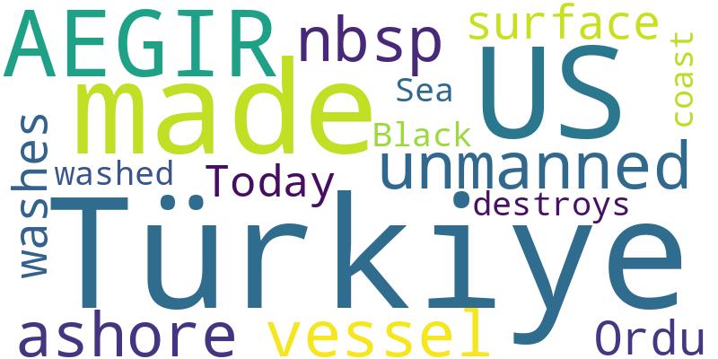

# News Report

- Run ID: `f70f0b3bc8f940d98247f5f0f2a69718`
- Week: `2026-W12`
- Window: `2026-03-16` to `2026-03-22`
- Status: `success`
- Sources queried: arxiv, crossref, news_rss, openalex
- New items found: 26

## Week's Trend

## Table of Contents

### Ship Autonomy
1. [US-made AEGIR unmanned surface vessel washes ashore in Türkiye's Ordu](#a74be991102bf1c5ce69022501fd0d77b0eb8fadc88806fb8526ee016626822d)
2. [Türkiye destroys US-made AEGIR unmanned vessel that washed ashore on Black Sea coast](#290ecc5a6b8fd059cd714141b10e04b1fc123ad5bc0f3cfbad242c6ddd504bb5)

## Ship Autonomy

---

### US-made AEGIR unmanned surface vessel washes ashore in Türkiye's Ordu

**Metadata**

- Date: 2026-03-21
- Authors: Türkiye Today
- DOI: N/A
- Link: https://news.google.com/rss/articles/CBMisgFBVV95cUxNTWdXVUlzTXNJSW83cVI4S0Q3bTRvVW01aHpfTkpMU0FTdDA0bWI2bmJwMWhZQWxzdXFXZFVNcTF3VjdTdTkzOHV1NU05UUhWRmZ1czF3djNhcnJkaDRkTmdsNThvMklKdnc0VHh3VWY5ZEM2Nm9WaU1xVmowN3VnREdWRFF5TzBBM2FROUhxVUN0NUVUOEt4eHVVZHNaVWc1YVVYeDc5SjlmN1J0TlY2MS13?oc=5

**AI Summary**

The US-made AEGIR unmanned surface vessel has washed ashore in Ordu, Türkiye. The incident occurred on March 21, 2026. No further details are available at this time regarding the cause of the vessel's arrival or any subsequent actions taken by authorities. The situation is currently under investigation.

**Abstract / Source Text**

> US-made AEGIR unmanned surface vessel washes ashore in Türkiye's Ordu &nbsp;&nbsp; Türkiye Today

---

### Türkiye destroys US-made AEGIR unmanned vessel that washed ashore on Black Sea coast

**Metadata**

- Date: 2026-03-21
- Authors: Türkiye Today
- DOI: N/A
- Link: https://news.google.com/rss/articles/CBMixwFBVV95cUxNRXJ6VThoV3Rsc0VzZ0dPRW03dEw5RVNUMmRBSEJZTlFzdWJhUHN2WHhtMXZTVDJUTDhnVzBDMGkyaFNJVkJpUW1pN3doS1k2Y1ItbHdlRHh4cDRTRW9MSmU3MGh6MnRSZnpya2lCSWUxMjZ4cmJZMmM3RXNVMmsxQnpzQk1Rc3Z1cmFxVEd5cnRxNlVzWWRycDM4WkJ2RjdTTjFCS2dNU013V05YQmIzMHNaVU1GUFdyamtoODVCdnRwS3dvRTNz?oc=5

**AI Summary**

Turkey destroyed a US-made AEGIR unmanned vessel that had washed ashore on the Black Sea coast. The incident occurred in 2026, but no further details are provided. No explanation or context is given for why Turkey took action against the vessel. The article does not provide any additional information about the incident.

**Abstract / Source Text**

> Türkiye destroys US-made AEGIR unmanned vessel that washed ashore on Black Sea coast &nbsp;&nbsp; Türkiye Today
