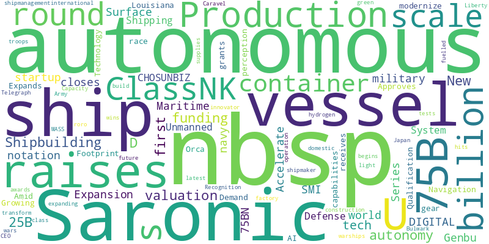

# News Report

- Window: `2026-03-30` to `2026-04-05`
- Sources queried: 36 Kr, Army Recognition, Baird Maritime, CNBC, Chosunbiz, Container News, India Shipping News, Inside Unmanned Systems, Israel Defense, MSN, Marine Log, PR Newswire, SSBCrack, Ship & Bunker, Shipping Telegraph, SiliconANGLE, Smart Maritime Network, The Robot Report, The Tech Buzz, WorkBoat, shipmanagementinternational.com
- Items in report: 24

## Executive Summary

Autonomous maritime technology dominated this week’s developments, with Saronic securing $1.75 billion in funding to scale production of autonomous surface vessels, achieving a $9.25 billion valuation. Regulatory milestones included ClassNK’s approval of autonomous navigation systems for the container ship *Genbu* and Orca AI’s qualification for ship perception capabilities. Defense applications advanced as the U.S. Navy began constructing Liberty class autonomous ships and tested the Bulwark Caravel for unmanned logistics. Japan also approved an autonomous RoRo vessel, while global sustainability efforts saw the first hydrogen-fueled engine operation for a commercial vessel. Meanwhile, geopolitical risks, such as naval mines in the Strait of Hormuz, underscored ongoing maritime security challenges.

## Week's Trend

## Table of Contents

### Ship Autonomy
1. [Saronic Raises $1.75B, Expands Louisiana Shipbuilding Footprint as Autonomous Surface Vessel Production Scales](#41a4e89e9e7beed1bb1bc5443eb09fcbe47144005a6fb570031eff58db7cfb7e)
2. [Saronic raises $1.75B at $9.25B valuation to gear up autonomous ship production](#e104a34719ea845be6f10348def3cf03787833adb4b98e34a068a3d9934af6d7)
3. [Autonomous ship startup Saronic raises $1.75 billion in race to modernize U.S. military](#133266bf9eb8639e919f207334c68adf221dfbab97d508a09a98c229a530c7bf)
4. [ClassNK Approves Autonomous Navigation System for Container Ship](#107fbaac8100125b18b04d906f351cdb32451e9c27f04a4820dfdbd6f81a7937)
5. [Saronic Raises $1.75 Billion to Accelerate Production of Autonomous Surface Vessels Amid Growing Military Demand](#78391223280df66a4a81c7cc274634c58526df73606ce7985d1396b622e57f70)
6. [ClassNK grants first autonomous ship notation to container ship “Genbu”](#b41322ec304052e680616cf8adf9f8a1f5b3c2a8aaee3ba401c73c287f0929ab)
7. [Orca AI receives ClassNK Technology Qualification for autonomous ship perception capabilities — SMI DIGITAL](#9958767a57e6b8a86adf9f70a27420feaa97a636200b6c1d11d828df301848d4)
8. [Autonomous vessel innovator Saronic Series D round raises $1.75BN](#3e38ced75ac864bdfd9356bdf6de324fab17471dee95b59ea606d84b4f5cada3)
9. [Liberty class autonomous ship construction for the US navy begins](#89c17ce716cd11f02bc3c5b8181a137f751dfba78046cd1d1f0083df91483ada)
10. [Saronic raises $1.75B to build autonomous ships at scale](#e28e19a0c16c75939c91184c2cf18f0984e72926706713f06b5ef2ec6a173bd0)
11. [Autonomous shipmaker Saronic hits $9.25b valuation in latest funding round](#1ffc05bf45dea93c7b99704cc8661300c2289e35f1c0a1683982d07b8db18b71)
12. [U.S. Scales Autonomous Vessel Production with $1.75B Saronic Expansion of Shipbuilding Capacity](#d05471d912e13845c39a96620058c2230c8e1f9a357a55d5eb9690fa0726496f)
13. [Saronic closes $1.75bn funding round to scale autonomous vessel production](#345ba9e08d35c8417c1395d05997dda0b84ecef41e808bfbc7dfaa152718f6b7)
14. [Defense tech startup Saronic raises $1.75B for autonomous warships](#aa073ead3aa4fa37159ac9a619a5c2cb0d2859813cde4ff46d780fda03aaba92)
15. [US tests new Bulwark Caravel autonomous vessel to transform how troops get supplies in future wars](#82a4fdae0015d50291f861741639e4794a1b973e6d58a87bb12ec82b271698ca)
16. [Saronic CEO on $1.75 billion funding round, autonomous vessels, and expanding US shipbuilding](#68de735c5b2bea3a45c5782340ac582c1e4c17390010bdbed38739aca98f1d20)
17. [Autonomous roro vessel wins green light from Japan](#bd9f380fb4dbfd859e4ea490f5eae808ee25129e9a7f1b153bfa3120e542829c)
18. [ClassNK awards world’s first MASS notation to domestic container ship “Genbu”](#46d0c1aeb948248ff56e6625e53ec5a045a36272f18e2ce657725bbf80b6d982)
19. [World’s first hydrogen-fuelled operation in factory of main engine for large commercial vessel — SMI DIGITAL](#08d7b9f954ef156c2277e5ac9b6981efcd14e11e94f4230bb67d237f8376a63d)
20. [Unmanned Ship Arrives: Company Completes $12 Billion Financing](#ef3229c6a0d399cf2fb1258f2a5f85f4d90b7690fb7628d0eace59f434aea9b8)
21. [Saronic Closes $1.75B Series D at $9.25B Valuation to Accelerate a New Era of Maritime Autonomy](#26c615ec7d46e4bf29f61f7f9852e0d9912f7e6330d3e6ec55a7b5bf54905334)
22. [Canada tech delegation reviews HD Hyundai R&D, eyes Korea autonomy tie-up - CHOSUNBIZ](#22815a25b0777953cf7e6898c40cecc41414b2b72dd5741b9fce480f439f9e6d)
23. [Analysis | The US Navy’s Weak Spot: Mines in the Strait of Hormuz Expose a Critical Gap](#a8dec768b2cbc264bf88b265e6de2ddb7c11ce37c72ea35e05c4850d7fd608c2)
24. [Saronic secures additional $1.75 billion for shipyard expansion and autonomy](#ada8b580f05ed4bfa74896c3b72307b62819aadbdfa7a5b31717ef0bbc08f083)

## Ship Autonomy

 
---
 

### Saronic Raises $1.75B, Expands Louisiana Shipbuilding Footprint as Autonomous Surface Vessel Production Scales

**Metadata**

- Date: 2026-04-01
- Authors: Inside Unmanned Systems
- DOI: N/A
- Link: https://news.google.com/rss/articles/CBMi2wFBVV95cUxQaG1FWEJOUlJ1RUpVWHVGa29vbTNEYnFoZlUzU1puc3dDYnBBT3JlZko5M1FYQmVGN1kzYVM5WXNyWWEyTXhrN1JadjJKbmphRGRPUU9LVUhKNjJCZVpjY2tiQVZnajhPOGFpTG1ZbTVsa044MEp5eXJGUUlDWkd5cnN6MDUwelluQVBDY0JCcTJ6b0ZrWFdmdE16T2w4ZlJRWDdQb3Q3SXFMZy0zUGNITUJjZE9YQ1k1TnZXbVotRGhUUUpqUXJfLXlfd0I0Y2RUZlRseUk1M3RyS1k?oc=5
- Relevance: 18.5 (66%)

**AI Summary**

Saronic secured $1.75 billion in funding and expanded its shipbuilding operations in Louisiana to scale up production of autonomous surface vessels. The company aims to enhance its manufacturing capabilities in the region as demand for unmanned maritime systems grows. This expansion supports the scaling of autonomous vessel production.

 
---
 

### Saronic raises $1.75B at $9.25B valuation to gear up autonomous ship production

**Metadata**

- Date: 2026-04-01
- Authors: SiliconANGLE
- DOI: N/A
- Link: https://news.google.com/rss/articles/CBMiqAFBVV95cUxQcURCSWtHTXdOeHhVVGhFcW1nTXJ6QXB2c1pBeXBESGk3ekplSTl5VnNQVldvV21EdV90ZGdEdFJ2aDZjb2s5QW5ZY1lXM0RrRjFQTkdVb2hORDFNR2prTDFDX1NxVnRiN3pBRkZ3OFJPSHlaUUJoZ1hsNl9PT1JHdGJfSmJSSFRjQ0VRY1prOC14RW5PRXpMUkxDY0pnUFE1akNzaWlQQ24?oc=5
- Relevance: 14.5 (52%)

**AI Summary**

Saronic, a company focused on autonomous ship production, raised $1.75 billion in funding, achieving a valuation of $9.25 billion. The capital will be used to accelerate the development and production of autonomous ships. This funding round highlights growing investor confidence in autonomous maritime technology.

 
---
 

### Autonomous ship startup Saronic raises $1.75 billion in race to modernize U.S. military

**Metadata**

- Date: 2026-03-31
- Authors: CNBC
- DOI: N/A
- Link: https://news.google.com/rss/articles/CBMimAFBVV95cUxPenpQNjFPZk96Zlg3N1VSaDgxX2V4NzR3ekVYMHZfX0gtaU1HRVB5SlJ6eU4tOUVwV0NucV9BOEd1TG5zMV9Uc0lncjFvbDJ3OC1oVnZaS1VTS012ZjlNS3llaVlPUk4wUFE2dzhndFZmaG43SEtGZ2xwUXdfaUZiRE5pbEdEdEdzSHo4YW5VVFJRY2FfLXNta9IBngFBVV95cUxQeUhkNHhkVDZrX0ZfRVRXNzdaZi1EWno1MHpIMXJBTmpMN0haVnRTQjNSVGM0QjB2U2JmZHlQTm9BSHItUjY5YjNobkJ3Sm5CSURrZWpJa1pZWGk2QkYwS28yNGJiakxVcUxGeFJWMkFFU0dMRVRwQ1J1OGVtMm9RaWpQWENYU18wb3YxMWIweUdqbzZNeWt4UDV4VVNsUQ?oc=5
- Relevance: 14.5 (52%)

**AI Summary**

Autonomous ship startup Saronic secured $1.75 billion in funding to advance U.S. military modernization efforts. The company aims to develop and deploy autonomous naval vessels for defense applications. This significant investment highlights the growing focus on integrating autonomous technology in military operations.

 
---
 

### ClassNK Approves Autonomous Navigation System for Container Ship

**Metadata**

- Date: 2026-04-03
- Authors: Ship & Bunker
- DOI: N/A
- Link: https://news.google.com/rss/articles/CBMirAFBVV95cUxNbjE2YU5FblNYQjVhS2F6LWxIV19xa0NMekJOYl9wUFZQS0pVV2RiLWZuSnJRRnl4QjZJRktFRFMtUXVab3ktNGhNZGg3SHhjOEtOT1Z4LVIwWmxrQ0szR2c2WURDWFI4akZzRDlwMkVhYnpDMEt3ZmdiZWpyekJLdmcxU2J4UkFVMzNaY1BqM2ZSNm1tclppZkc0c0JKSjhDSThSVFZqWGhUZDBk?oc=5
- Relevance: 14.0 (50%)

**AI Summary**

ClassNK has granted approval for an autonomous navigation system designed for a container ship. The approval marks a step forward in the integration of autonomous technology in maritime operations. The system's specifics and the vessel involved were not detailed in the provided text.

 
---
 

### Saronic Raises $1.75 Billion to Accelerate Production of Autonomous Surface Vessels Amid Growing Military Demand

**Metadata**

- Date: 2026-03-31
- Authors: SSBCrack
- DOI: N/A
- Link: https://news.google.com/rss/articles/CBMi1AFBVV95cUxQeUFieElWd0NzS00zQkt3Z3YwNnZtX29rU045YXNKTnh0dlpQcHd4QV9GcElGUHBPdE1aUDkza0FFY2JzUElXZHNSMktSYW5TQXpWZjdTUGQ5NE9BN0pmOHJsVmJjZVJpNTUxenlyZXBNOW5uWVV6U2I3QzBxVGo4aTVHTWRLOXRvTmhMV3RpU0ZRNFVadFlzM2N0V3dpUEYySExVTUdQeXNkaHU1bXUycHBQLXMyeDNwV0l6aEx2SkhWVlN2VjRmLWk4cGtYbVlFR0dLeQ?oc=5
- Relevance: 14.0 (50%)

**AI Summary**

Saronic secured $1.75 billion in funding to boost production of autonomous surface vessels, driven by rising military demand. The investment aims to accelerate development and deployment of unmanned naval systems. Saronic’s expansion responds to increased global interest in autonomous maritime technologies for defense applications.

 
---
 

### ClassNK grants first autonomous ship notation to container ship “Genbu”

**Metadata**

- Date: 2026-04-03
- Authors: Container News
- DOI: N/A
- Link: https://news.google.com/rss/articles/CBMingFBVV95cUxNM0ZBdWxVak4wc0czajN0Rzh5WThlNDZ2NHJVU3dteWFyQkpfS1VWcWRIVjFWd0RmZ0Y3WXpndmRNLU0yTjZidTFLR3FPTDF1Znd3d3ZvcG1MNmxPUDdyLXA4Mk9qa3A0S0hNVWJLTVpmeFJwZzlfUjhjWGdNd2ZxOEFCSTZ6eG90aDRJSlk1emJmWEpjZFByRk5pTGdUdw?oc=5
- Relevance: 13.0 (46%)

**AI Summary**

ClassNK has awarded the world’s first autonomous ship notation to the container ship *Genbu*. This certification recognizes the vessel’s advanced autonomous navigation capabilities. The notation signifies compliance with ClassNK’s guidelines for autonomous ships. *Genbu* is operated by NYK Line.

 
---
 

### Orca AI receives ClassNK Technology Qualification for autonomous ship perception capabilities — SMI DIGITAL

**Metadata**

- Date: 2026-04-02
- Authors: shipmanagementinternational.com
- DOI: N/A
- Link: https://news.google.com/rss/articles/CBMi6gFBVV95cUxPMUdMRDQ5cFpmc1ZpUkN0ekdWSnNTWnQ5NUZEdEQ0QndTZlgxRlZ0TVozZTJoM0d2d2VSaF9JZzNZdm9aYTNaZlhoNDkzaEt2RVU4SWp4cVg0cWM2dEw5VGdDTkpNS0l1QlVtbkQ3NkZvSjFxN3Rpb3M4VklHdE5NaEx3WWpkYWM0b1VBcWlkZ0Y2UFFPRy1XRjNxQVRXNEpHVHRYMTVJTWdVUFFIN3RYdzJ4NFJHazYwdXhUVmRXUmlha3dYeEJsY2d0TktWdWUtLWJlSDV4RWRqSFpKRlZibmh0b1pTLVdMREE?oc=5
- Relevance: 13.0 (46%)

**AI Summary**

Orca AI has been granted ClassNK Technology Qualification for its autonomous ship perception capabilities. This qualification recognizes Orca AI's technology for enhancing safety in autonomous maritime navigation. The approval highlights the system's ability to detect and avoid obstacles effectively.

 
---
 

### Autonomous vessel innovator Saronic Series D round raises $1.75BN

**Metadata**

- Date: 2026-03-31
- Authors: Marine Log
- DOI: N/A
- Link: https://news.google.com/rss/articles/CBMixwFBVV95cUxONzNGME5KSkM3ckpSbDk3WFR3VXctY3otc1EtTndzV0p1TjZZVHJSaXlDMW1tYzgwOXpGVTMyR0dBVE1Lb1F4S01Hank0Ym5WLUc1dVV4aEF1WURyTU4zVHpFWkNfby1GUjBwbk5jeGwxV3pYVkNpTEkwbFZGQjJNV05JVjR3N05QOURFZEJ6OHFGU01JaWFXdGVmWjhhYUdkeUNVcEhpVTYzbG5ibE5xOWxxbmZOc2Vaa04tbGN2S3E1TDIwLU9N?oc=5
- Relevance: 13.0 (46%)

**AI Summary**

Saronic, an innovator in autonomous vessels, secured $1.75 billion in its Series D funding round. The funding round was announced on March 31, 2026.

 
---
 

### Liberty class autonomous ship construction for the US navy begins

**Metadata**

- Date: 2026-03-31
- Authors: Shipping Telegraph
- DOI: N/A
- Link: https://news.google.com/rss/articles/CBMisgFBVV95cUxNeU1XTlN2YXpmQUx3NXN5TkVFQzVJT3JIa0k0eFJBa3JYa3RIQUtmRG5tNWgzaTBqS1FVU21KbGhTaUZkaTl5anlJRGpwWHNDaXFabnBTVEN2dFZmbzkyZ19GZmtMdDdheFZuUndHZENvc3Z1aGlDWU1TRGNra3pVYVJnVWNJZGRrREw0dGNWem9KcXJRblVSbEFuNnhKWDJ3RUpZUjNZb3FLOXF0R0tNUFJR?oc=5
- Relevance: 13.0 (46%)

**AI Summary**

Construction of the US Navy's new Liberty class autonomous ships has begun. These vessels are designed to operate without a crew, enhancing naval capabilities. The initiative aims to modernize the fleet with advanced, unmanned technology.

 
---
 

### Saronic raises $1.75B to build autonomous ships at scale

**Metadata**

- Date: 2026-03-31
- Authors: The Robot Report
- DOI: N/A
- Link: https://news.google.com/rss/articles/CBMiiAFBVV95cUxPVEVHUzYxbjN0Wk56LXhOR2RYWXJCeTNuRW1ub0hIaEVnSm9wdUlKOHFOdHhyWEZ6eUtkTU12SlExQkxQVFBSZ1lfQVgzMDFsUi13M2R2VzFMS2VTRzZKNHNyaWRoeGxhMEVfdGk3RkdVUFVNWlFabEtMVkw0eTBtZmZ5Uzg2VUpN?oc=5
- Relevance: 13.0 (46%)

**AI Summary**

Saronic, a company focused on autonomous ships, raised $1.75 billion to scale its operations. The funding will support the development and deployment of autonomous vessels at a larger scale.

 
---
 

### Autonomous shipmaker Saronic hits $9.25b valuation in latest funding round

**Metadata**

- Date: 2026-03-31
- Authors: Baird Maritime
- DOI: N/A
- Link: https://news.google.com/rss/articles/CBMi1wFBVV95cUxQQ0ZhdmszWndvWkI0ZGR4YmNtcHlqSFR2cUxQd2lSMXNJdW1malNMRjhrTlp1ZVU0NWRCQnFCQldELUVOQ0tQS28yMWZxT05DZ01oSHR2OGNBMmVtYlVEOXJMR0M1Y0xRcjFmdE5jYy1SMGNtMVBrU2ZjbDdiQkpNNlEzY0tnSi0xdkZMSTB2VW8yR280M2hqZUw4MXJXbER0azRIV3U1YjBiZjJMNW5pYTdkVUV0QVBjeXB2X0F2UU5aVC1qT2xJYkVDTDJxRUlIcVNGdEUzMNIB5AFBVV95cUxNWHRRb094eTFaTmVzYmJ1bXBOT0RKendNdFBfMUxZa2g1REhGT05JTVpwaF9xU2Z0MVBhRkdoQWtwY0kyQ3pJYVQ4T0pTS0x0TXBfV2MybndidUxQWk1leDV2cnFraEloVjVSbTY0RG8zakM5c3dZRkZlaEwxa09NX2padnlib0pSVEFkSUVieXF4QTZBOE10bWs5Sm4teENPMnVHM19tc2VNcFlBYTczUjhKTmE3eHlJbUs0eGY5WG5zWjNPOXUzMENzM21DU1paU2YwSC1ZaG5uTWNKemUxNjZTNno?oc=5
- Relevance: 12.0 (43%)

**AI Summary**

Saronic, an autonomous ship manufacturer, raised a new funding round valuing the company at $9.25 billion. The latest investment round highlights growing investor confidence in autonomous maritime technology.

 
---
 

### U.S. Scales Autonomous Vessel Production with $1.75B Saronic Expansion of Shipbuilding Capacity

**Metadata**

- Date: 2026-04-01
- Authors: Army Recognition
- DOI: N/A
- Link: https://news.google.com/rss/articles/CBMi2AFBVV95cUxQeWRBTnpDY2F6RTU3NnJsSTU5b1lQbWwwSXA3M2huOFdVV0VLdk9ES3V2eU1vZHZvSExoMG42SVFhbThTakFhd2JvN2Q3VFdPZ0l6VkdqZDlQbldLM2V1R0tPZlZ4amdGVzBQdkpXLTNXdXFKbnR1eE5fVTNjNXBqcFVZYmFHcEhLVVV2Z0tIa0oxMVp5aWZseUtpNm4xNWoxb194ZGtUdXB2XzBZWHAwM2lkVE5UY0ZJLTVuMDJYSHBmYmNJWGdNR3hEVjRhZzQ5NkNSWHBXbGw?oc=5
- Relevance: 11.5 (41%)

**AI Summary**

The U.S. is expanding its autonomous vessel production with a $1.75 billion investment in Saronic's shipbuilding capacity. This expansion aims to scale up the manufacturing of unmanned naval vessels. The move is part of efforts to enhance the country's maritime defense capabilities.

 
---
 

### Saronic closes $1.75bn funding round to scale autonomous vessel production

**Metadata**

- Date: 2026-03-31
- Authors: Smart Maritime Network
- DOI: N/A
- Link: https://news.google.com/rss/articles/CBMiugFBVV95cUxNWVJTYTNncTQ0TFRzNVJiczMwcEVBVW9ISC0tNjNFQlZpZnF4aGZrZGRweVFsZ0JNMWZuUHYxTVVXeUktSi1xTXhPdEtHckdXNmlHR1ZSaUZiZkZZVUw4YVUzNUJId2w2dVNuSE9xbnpYb01JTE82YmNtUkQ4aWNRVFZ6V0JPalhHaHRWSEJpa1hqVTV3QTBFb1M5X3JGaE9WNHRMZkRGeDZGZDRvUXhSUFlrSzF3LWpNTXc?oc=5
- Relevance: 11.0 (39%)

**AI Summary**

Saronic secured a $1.75 billion funding round to expand production of autonomous vessels. The investment aims to accelerate the development and deployment of its unmanned ship technology. This funding will support scaling operations and advancing maritime autonomy solutions.

 
---
 

### Defense tech startup Saronic raises $1.75B for autonomous warships

**Metadata**

- Date: 2026-04-01
- Authors: The Tech Buzz
- DOI: N/A
- Link: https://news.google.com/rss/articles/CBMinwFBVV95cUxOSmxzUkp4NEFaM0VDR3I3NWJ4NWhjVjUwZlAyZENzV2FXQUFackI5bFc0cWc5bWFsSDhRYjgzNlNXdmkzZzhZODRLTndKWWY1QVV3VDFoYUd3ZV9LNDVrZThVeXp6QjlzQWNMM1RIOFZNMDV3M1RWQkgtUzZLZjZpQUZ1U3RLcEtEOE1zMnZJNkMxeEh0a0VsLXRpNElLcDA?oc=5
- Relevance: 10.5 (38%)

**AI Summary**

Saronic, a defense tech startup, secured $1.75 billion in funding to develop autonomous warships. The investment will support the company's efforts to advance maritime defense technology. This funding round highlights growing interest in unmanned naval systems.

 
---
 

### US tests new Bulwark Caravel autonomous vessel to transform how troops get supplies in future wars

**Metadata**

- Date: 2026-04-01
- Authors: Army Recognition
- DOI: N/A
- Link: https://news.google.com/rss/articles/CBMi3wFBVV95cUxOdE12Q0cyLU9qSXhUeEZoVEdiNk41M2lJMWwxVVFBTjQ2U2dVUGdJdllzZzFQU1A2eUFQY3duT2FkM0Q1MVJiRkhhZXV3SVpXMXV2blktc0tzbEhPOHI5SVg3SnJDLTFaVG1BMmxNdkVCbUdGSENzRFRVWUs1d0tfVFZ2cEtPRzM4T3Q2UDFQSEpfWVo3cnNDcWZJZ3VrWGpfS25NelRwakhSTW9VelFCOGU2eVhib3Q4UjVjUWFJdnZLTy1QQmJWd29wLTNEQTloSklCVm41a3JPSF9nMHFn?oc=5
- Relevance: 10.0 (36%)

**AI Summary**

The U.S. is testing the Bulwark Caravel, an autonomous vessel designed to revolutionize military logistics by delivering supplies to troops. This unmanned ship aims to enhance future warfare by improving efficiency and reducing risks to personnel. The Bulwark Caravel represents a shift toward automated resupply solutions in military operations.

 
---
 

### Saronic CEO on $1.75 billion funding round, autonomous vessels, and expanding US shipbuilding

**Metadata**

- Date: 2026-03-31
- Authors: MSN
- DOI: N/A
- Link: https://news.google.com/rss/articles/CBMi1wFBVV95cUxQak5lNDlZMkRaODY3eS05elBkYzB6WVFyRmZlN3Z6amlxVkNJODVxR1ZrT0VndGZwSUlaaGtYNGZBbGhvSWVHN0wzcGFudmkyVVhUSU5nUHpDOFAtcUw0dmVVdFRRWjBwNG9yWFVEQl93eldGb0oxbllrWVFnUnc0YXk0THVWb091aTBoRVB0NjExV0NXcVhmZjBlN2RmTXFxR1dIR0N6czNHN0k1Rkw4WWs4c1NJY0xtbmI4Vnh5TVNsbTZYZVFMb25sazRTTTV3NFQ5elFUYw?oc=5
- Relevance: 10.0 (36%)

**AI Summary**

Saronic secured a $1.75 billion funding round to advance autonomous vessel technology and expand U.S. shipbuilding. The company’s CEO highlighted plans to enhance maritime autonomy while strengthening domestic shipyard capabilities. The funding will support scaling operations and deploying next-generation autonomous ships. This initiative aims to modernize the maritime industry and reduce reliance on foreign shipbuilding.

 
---
 

### Autonomous roro vessel wins green light from Japan

**Metadata**

- Date: 2026-03-31
- Authors: Shipping Telegraph
- DOI: N/A
- Link: https://news.google.com/rss/articles/CBMipwFBVV95cUxNM01IN3NFNXdveDVsaGpaQXRsbFdZZllyMVVDS2s2OEJNdk1Hakk3X2x3QVhpYWtrUGdrOWZZT1dYQWs5OW9jaV9QdktBRHB3blZHZi0wZU1EN0otcHY5X1hkX1hyMmlYazFYdFE4eDlCM0t1cDl6NlYyN25TZk9rT0piMUc1ZHFaNzk2WjdGYU10X2tWdzB0NEx0MlZDbGhEVDFUd0pJWQ?oc=5
- Relevance: 9.5 (34%)

**AI Summary**

Japan has approved the operation of an autonomous roll-on/roll-off (RoRo) vessel, marking a significant step in maritime automation. The vessel received regulatory clearance, allowing it to operate without a traditional crew onboard. This development highlights Japan's push toward integrating autonomous ships in commercial shipping. The decision underscores advancements in maritime technology and safety protocols.

 
---
 

### ClassNK awards world’s first MASS notation to domestic container ship “Genbu”

**Metadata**

- Date: 2026-04-04
- Authors: India Shipping News
- DOI: N/A
- Link: https://news.google.com/rss/articles/CBMiqAFBVV95cUxNbDJjVGtONWZjUFJVQ1EyQlVGRGdCUUg4MmRCU0xTNlVNUzNrRFFDYnV0SWppcUxhRWtmUTFPWmdjb050MTlDYmZLNDRYMm1aaHBMM0poNDJwZkg4QVEwbkNFYUhOLW1wQmlsOGJSVUFqVW9hcTROVDB0M0pmRC0teGNiSmFlcndDTGtabGN0S2RPbHFwMlRHLTd1elNOZURWNDExOWJKak8?oc=5
- Relevance: 5.5 (20%)

**AI Summary**

ClassNK has awarded the world’s first Maritime Autonomous Surface Ship (MASS) notation to the domestic container ship *Genbu*. The recognition highlights the vessel’s advanced autonomous navigation capabilities. This milestone marks a significant step in the adoption of autonomous shipping technology. The notation was granted following a comprehensive review of the ship’s systems and safety compliance.

 
---
 

### World’s first hydrogen-fuelled operation in factory of main engine for large commercial vessel — SMI DIGITAL

**Metadata**

- Date: 2026-04-02
- Authors: shipmanagementinternational.com
- DOI: N/A
- Link: https://news.google.com/rss/articles/CBMi4gFBVV95cUxQOS1CdDVhVndrel9xdmFKUUo1YWQ5N0I2cGlsUkJtZ3pud2lGVWlKQ1F5UGcwdmJDTDhNVmpYV0tSX3JjTmoxR19lOVpwR2IydlRkeHRvVjV4UXM0VEZONWowRlRZUFZyaFp6VHVkZ3M3NE5Xd29xTUJkd0Q1V0ppa3V1aTBWVkdYaTRyYUZFOGRmRjFCM2FCcHlFYmRVV0htNWl3LUhPTnNsbW5MaTFNRERFSW81RWI3NFhrNmNPSXhCenFQaGttRW9kb3hjb2JEQW1ZNmprV2g5WEdkNkd4eE1R?oc=5
- Relevance: 5.0 (18%)

**AI Summary**

SMI DIGITAL reported on April 2, 2026, that the world's first hydrogen-fueled operation was conducted in a factory producing the main engine for a large commercial vessel. The news highlights a significant milestone in the maritime industry's shift toward sustainable fuel alternatives.

 
---
 

### Unmanned Ship Arrives: Company Completes $12 Billion Financing

**Metadata**

- Date: 2026-04-02
- Authors: 36 Kr
- DOI: N/A
- Link: https://news.google.com/rss/articles/CBMiU0FVX3lxTE9RRFBZanRRT3E1X2lwZ0IwNkN2SHh0bFdwRjJkODNhb0kwdEhwZE1qU3Y1aFNUMVdxZmh6TWU3SlJzbkczMlBoNkFQcTdQNndVbW5z?oc=5
- Relevance: 4.5 (16%)

**AI Summary**

A company secured $12 billion in financing to develop and deploy unmanned ships. The funding marks a significant milestone in advancing autonomous maritime technology. The investment will support large-scale production and operational deployment of the unmanned vessels. This initiative aims to revolutionize global shipping and logistics industries.

 
---
 

### Saronic Closes $1.75B Series D at $9.25B Valuation to Accelerate a New Era of Maritime Autonomy

**Metadata**

- Date: 2026-03-31
- Authors: PR Newswire
- DOI: N/A
- Link: https://news.google.com/rss/articles/CBMi4wFBVV95cUxNY2ZYYnJQUVg2OXVyMS1VTG8wZHVNdFpGUWFRUVRTdFY3bWhzWkE1LU1nSVo1TVRpNjJ2MkRjTkVtMXJXMzdULUVZNUpPS05LcTJsaktLMlhsbXBDZUh1NjlaRGQ2a19xdzhSWERsWnNtZ3FsVTE0YXMwU2dzQjc1bUdwUEFXWnhUWUdScHIyS1Z5T2hWNHBmMFBHNVRRMF9wZEJvblRPQ2E2SE5WMzdUWm9xdlZFTEFkMnQ3ODRYb3hRMzhqZlg2R3E4c1ZXeGRpZk9sRjFjZkMwZ19RMG9JV29paw?oc=5
- Relevance: 4.0 (14%)

**AI Summary**

Saronic raised $1.75 billion in a Series D funding round, achieving a $9.25 billion valuation. The company aims to accelerate advancements in maritime autonomy with this investment. The funding will support the development and deployment of autonomous maritime technologies.

 
---
 

### Canada tech delegation reviews HD Hyundai R&D, eyes Korea autonomy tie-up - CHOSUNBIZ

**Metadata**

- Date: 2026-04-01
- Authors: Chosunbiz
- DOI: N/A
- Link: https://news.google.com/rss/articles/CBMiggFBVV95cUxPTmFHOUxJdkdseTQ3eDVVVGFPUTA4UTJwVk1JemdxNXhmVzFqb1lQeGxRODNCY1VqQVpISWN2REV2cndEZElxaW1fSnF5OFZnYjRTeFpMZ3ZGZGhJaFlwNk0tRnUwSjlkNXVDLVR4UnBMLU00NkZnS3p0anoyVkZvV0dn0gGWAUFVX3lxTE5IdmVhZzVzMFF0Nkh5WGhOV2E3b1F5d2tpSFZNcFBTVEZ2d0lBU3FKN3JJWXNYV1BlWW9ldGZvajA0aEpwZFdRX2ZVYTM4QVNvenpKb2o0TktQU21HRmhLczdiWTVHazZUc3BnOXA5eEFTZWFfR3NfZGd3UmJEUGlGbEhocW5kdnlNQUUyRU1ObVUzckpoUQ?oc=5
- Relevance: 3.0 (11%)

**AI Summary**

A Canadian technology delegation visited HD Hyundai’s research and development facilities to assess its autonomous driving technology. The visit aimed to explore potential partnerships between Canada and South Korea in autonomous vehicle development. Discussions focused on collaboration opportunities in the tech and automotive sectors. The delegation’s review highlights growing interest in cross-border innovation in autonomy.

 
---
 

### Analysis | The US Navy’s Weak Spot: Mines in the Strait of Hormuz Expose a Critical Gap

**Metadata**

- Date: 2026-03-31
- Authors: Israel Defense
- DOI: N/A
- Link: https://news.google.com/rss/articles/CBMiWEFVX3lxTFAyTE02YWJabVZxMFE0WHBDTEY0bjZiWjU1NjJoaWVYTHhrdWxpODRaeVd6MnZTWXdzcl9Fa2xVZ3BGR2tEcUtPSHlheHF3QTNQQ0Q5VFhzT0o?oc=5
- Relevance: 3.0 (11%)

**AI Summary**

The US Navy faces a significant vulnerability in the Strait of Hormuz due to the threat of naval mines, which could disrupt critical maritime traffic. This analysis highlights how mines pose a major risk to naval operations and commercial shipping in the region. The Strait's strategic importance makes it a potential flashpoint for conflicts involving mine warfare. The US Navy's preparedness and countermeasures against this threat remain a critical concern.

 
---
 

### Saronic secures additional $1.75 billion for shipyard expansion and autonomy

**Metadata**

- Date: 2026-03-31
- Authors: WorkBoat
- DOI: N/A
- Link: https://news.google.com/rss/articles/CBMiogFBVV95cUxPRmlqYUptZVlvNnJ0bHZPVlZyWEJjNVdFSmhRam5nZ1lrOWJTNWFhQWVvbi02VVRwYTNfY09ObFpHRGl2RWRnaFZJT3pDQXdfMWNhMWNscnJ3WVR3d2ZuTUdKWlY1eUFLX1ZTZkUxajg3YzJuemZmM3NTMjNLMEZJLVlleGV0VUxoMEhWMkR3WWdYZ2tjaENOeEh3WlNLU0dDbGc?oc=5
- Relevance: 3.0 (11%)

**AI Summary**

Saronic has secured an additional $1.75 billion in funding to expand its shipyard operations and advance its autonomous vessel technology. The investment will support infrastructure growth and the development of unmanned maritime systems. This funding follows prior financial commitments to bolster Saronic's position in the defense and commercial maritime sectors. The expansion aims to enhance production capacity and accelerate innovation in shipbuilding automation.
