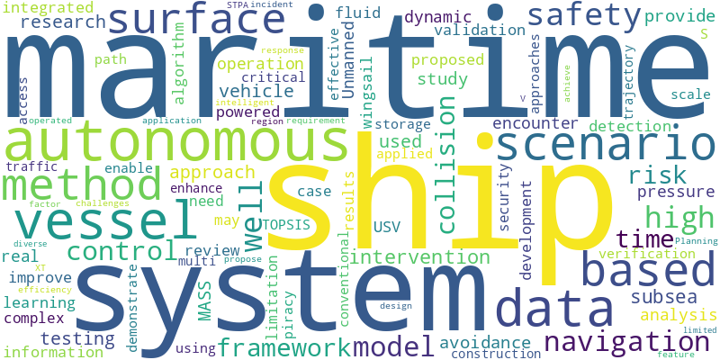

# Papers Report

- Window: `2026-03-30` to `2026-04-05`
- Sources queried: crossref, openalex
- Items in report: 30

## Executive Summary

This week’s research digest highlights advancements in autonomous maritime systems, focusing on safety, navigation, and regulatory frameworks. Key developments include AI-driven frameworks for generating realistic maritime encounter scenarios, negotiation models for collision avoidance in mixed fleets, and time-dynamic path planning algorithms for extreme sea conditions. Legal and regulatory challenges for autonomous ships are addressed, with recommendations for regional cooperation. Additionally, innovations in bathymetric data modeling, adversarial control for unmanned vessels, and data-driven risk mitigation for piracy underscore the sector’s technological and operational progress. Emerging themes include the integration of AI, machine learning, and system-theoretic safety approaches to enhance autonomy, efficiency, and sustainability in maritime operations.

## Week's Trend

## Table of Contents

### Ship Autonomy
1. [From Vessel Trajectories to Safety-Critical Encounter Scenarios: A Generative AI Framework for Autonomous Ship Digital Testing](#73dce9e1472504d27eb85e7ca7847da23b0b6b51fd793f69b3b35836dd709041)
2. [Legal Challenges of Maritime Autonomous Surface Ships: A Comparative Study of Neighboring States and Implications for Vietnam](#9148d854b78ac51bf7a1342cacbf1b3fcb2b7f9cfc682a1344ef875eccb96d70)
3. [A negotiation method for cooperative collision avoidance between ships in mixed navigation scenarios: model construction, strategy driving, and unilateral learning](#1ae8af95d0d6e2c65b9102558e3e311120add50c37bb0668e2438ef01fd1f3ca)
4. [Research on Autonomous Ship Route Planning Based on Time-Dynamic Theta* Algorithm Under Complex and Extreme Sea Conditions](#4c92d8a54f9fe0633cd953b673d5c037d899c66e5ba0632dd036603273be4acd)
5. [Development of collision-case-based testing scenarios for validating autonomous ship collision-avoidance algorithms](#4d5774ffa49c94cef750a72ba208c20887c5aad6a693e5a217fad16045146467)
6. [Comprehensive literature review of systemic safety analysis: trends and development in the maritime sector☆](#c8d286af5d4855c9cd8db18660fa6db80394eb88f40a77afbeed467c4d00d92f)
7. [Maritime autonomous surface ship for experimental trajectory tracking in the ocean](#3151e93d44a08487b98a3d7be30ebcf74135a57cc2af11a4be2961ae4c5fc5d1)
8. [A High-Density Bathymetric Data Model and System Construction Approach Integrated with S-100 for Unmanned Surface Vessel Intelligent Navigation](#d2b228555b2bd2f2b6bf8b7fb558bebea114463ffa7f60d250c71817bec12cab)
9. [Approximate optimal fast terminal sliding mode control for autonomous surface vessels subject to input constraints and uncertainties](#0bc76d0f4ac996c9247631707d92e5341e02221d21f8907518e77e0d1b5a91b3)
10. [Lightweight Visual Localization of Steel Surface Defects for Autonomous Inspection Robots Based on Improved YOLOv10n](#76b3b8e06ae3c0124538be2ade00bd8c56f0526a5665c7710839fd0bee3f8745)
11. [Data-driven risk mitigation of Southeast Asian maritime security](#1a0d5a18a889b4c0b89836a7b37201ed795634ceee3566f801cebcfda26f2167)
12. [Ensemble-Based Machine Learning with PSO and GA for Ship Coating Detection Using Portable Vis/NIR](#3c8701cf7b2524014640a9a751ac52270beb896b928d2cb24897a8eb0a36a173)
13. [Game-Based Adversarial Control for Unmanned Surface Vessels via Fully Actuated System Approach](#2478bdda69b137cd68692c12996a14221591c0460a268fec83f24a2f6773523d)
14. [An Integrated Controller System For Unmanned Surface Vehicles (USV)](#23c5d6a1dffa3419b14f82ecb1f7e42e1675fae7e4cf35bb7456a9af431598d3)
15. [The Case for Powered Propellers on Ship Wingsails](#c8abc59e05e4a661d7c7581f1e934e9cfd935297c7e77463c687ad34a3a629be)
16. [Conceptualization of information and communication system development for remotely operated maritime transport in Arctic region](#10f1bea091c66cf324ca2d28b6b0af4b4d9556c9295fc868c28d86fce9f57441)
17. [A hierarchical learning-based autonomous berthing trajectory planner for unmanned surface vehicle](#e5184fdce262ae3f4b9fff1d689152f8ab4a008153e0f8dfd9f1418302866fbb)
18. [Powering Change: Electrically Operated Subsea Safety Module for Future Well Intervention](#7419546d8049bd8489d08d0565dc88126b03fdb84523c1a5e3e0aa981ba70364)
19. [Global navigation-local operation: Pose optimization and multi-sensory guidance strategy for autonomous mobile manipulators](#04f1779cfbd1802c4e7eb08d21653221db623d2f395e03449c9e77d8b20395d8)
20. [LiDAR-based vehicle detection and tracking for autonomous racing](#e80afc34cac7b4a6e3d414e6324a1f4d0d14935de9b46db7c015805c7e84f87b)
21. [Shared control for autonomous robotic navigation: A review](#4e472496b56f0d3ba58cdfaf1573b88eb96fd4009fae1dea2a3fa9f2092a474f)
22. [Optimal Design of Type 2 High Pressure Vessel for CNG Vehicles](#b518d22469f702afe4f8d22510f450233c5865c6513482c5e196f280bbc2a9ef)
23. [IQ-RRT*: A heuristic approach to path planning for unmanned surface vehicles](#1e174cf4c0e8bc0c0741641e62a6204153625ff4a75c6b27abcdf0ae8da264a1)
24. [Influence of local hydrodynamics on ship drift leading to ship-bridge allisions](#559b4fc6c5e1ae023b431e52436d8020c5af9c363981e4acddb3aaa444011de5)
25. [Hierarchical Vessel Safe Operation in A Port through CBF, MPC and RRT-like Spatiotemporal Path Planning](#f6d3ab885b4ac3918683d17df0f80b78e36d078d16c256438f58bb7f00207fd0)
26. [AIVV: Neuro-Symbolic LLM Agent-Integrated Verification and Validation for Trustworthy Autonomous Systems](#dd2ebeb8be25e8292fec1c9f07b1201a5ddf5923955acf71ebbaf18b220ce7c8)
27. [Data-driven event-triggered heading control for autonomous surface vehicles based on an adaptive observer](#4cf9ad4f336cf1b80da671f29f6f02ab0fd6240f5f9c2003014f4328300b045f)
28. [Nonlinear stability analysis of autonomous container ship under environmental disturbances using hardware-in-the-loop validation](#28082749b93f8c22dbad3999afa23e6a5709c037e77429829b7f087636efb827)
29. [Regulation of maritime autonomous surface ships on carbon emissions and marine pollution: Context, challenges, responses](#8730dc53022eec6d85507fbdeaf841dc52171a9b91affb28bb73e2b090e0ffdb)
30. [Heterogeneous multi-scale enhanced YOLOv8 for real-time maritime obstacle detection on unmanned surface vessels](#bb3fcf5bf6f0853ed00a7fc36b9b18b6a6bf7233b3a104cac2f098914baeb524)

## Ship Autonomy

 
---
 

### From Vessel Trajectories to Safety-Critical Encounter Scenarios: A Generative AI Framework for Autonomous Ship Digital Testing

**Metadata**

- Date: 2026-03-30
- Authors: S. Sun, Liangbin Zhao, Ming Deng, Xiuju Fu
- DOI: 10.48550/arxiv.2603.28067
- Link: https://www.semanticscholar.org/paper/29008416c0dad1c9efd9b32306f25a31a71d09ec
- Relevance: 19.5 (70%)

**AI Summary**

The paper introduces a generative AI framework that converts real-world ship trajectories from AIS data into realistic safety-critical encounter scenarios for testing autonomous maritime navigation systems. It uses a multi-scale temporal variational autoencoder to improve trajectory realism and robustness, even with noisy AIS data. The method enables scalable generation of diverse high-risk scenarios beyond historical records, supporting digital testing and safety assessments. Code for the framework is publicly available.

**Abstract / Source Text**

> Digital testing has emerged as a key paradigm for the development and verification of autonomous maritime navigation systems, yet the availability of realistic and diverse safety-critical encounter scenarios remains limited. Existing approaches either rely on handcrafted templates, which lack realism, or extract cases directly from historical data, which cannot systematically expand rare high-risk situations. This paper proposes a data-driven framework that converts large-scale Automatic Identification System (AIS) trajectories into structured safety-critical encounter scenarios. The framework combines generative trajectory modeling with automated encounter pairing and temporal parameterization to enable scalable scenario construction while preserving real traffic characteristics. To enhance trajectory realism and robustness under noisy AIS observations, a multi-scale temporal variational autoencoder is introduced to capture vessel motion dynamics across different temporal resolutions. Experiments on real-world maritime traffic flows demonstrate that the proposed method improves trajectory fidelity and smoothness, maintains statistical consistency with observed data, and enables the generation of diverse safety-critical encounter scenarios beyond those directly recorded. The resulting framework provides a practical pathway for building scenario libraries to support digital testing, benchmarking, and safety assessment of autonomous navigation and intelligent maritime traffic management systems. Code is available at https://anonymous.4open.science/r/traj-gen-anonymous-review.

 
---
 

### Legal Challenges of Maritime Autonomous Surface Ships: A Comparative Study of Neighboring States and Implications for Vietnam

**Metadata**

- Date: 2026-03-30
- Authors: Van Truong Nguyen, Xuan Long Nguyen, Dang Thai Vu, Hanh Hoang Thi Hong
- DOI: 10.65154/ijmst.14
- Link: https://doi.org/10.65154/ijmst.14
- Relevance: 18.0 (64%)

**AI Summary**

The study examines legal challenges posed by Maritime Autonomous Surface Ships (MASS), highlighting benefits and unresolved issues. It reviews regional policies, including standards, test areas, and sandboxes, from neighboring countries, while assessing the adequacy of international conventions. Recommendations are provided for Vietnam and other ASEAN nations to expedite MASS regulation development and testing strategies. The paper also stresses the importance of enhanced regional cooperation in ASEAN.

**Abstract / Source Text**

> International Maritime Organization and countries have been paying special attention to Maritime Autonomous Surface Vessels (MASS). MASS is assessed to be able to bring benefits to the world maritime industry, but it also raises legal issues that need to be further studied and improved. Countries in the region have many activities related to MASS, typically issuing MASS standards, building MASS test sea areas, smart ports, sandboxes, etc. This study analyzes and evaluates in detail the policies, strategies and regulations of some typical countries in the region on MASS. In addition, the article also analyzes and synthesizes the current regulations of international conventions, whether or not they are suitable for MASS. From that analysis, the article presents experiences for Vietnam as well as other countries in the region to shorten the time to build and improve regulations for MASS. Develop action strategies for the construction, testing and development of MASS in practice. At the same time, the article also emphasizes the need to further strengthen regional cooperation in the ASEAN region.

 
---
 

### A negotiation method for cooperative collision avoidance between ships in mixed navigation scenarios: model construction, strategy driving, and unilateral learning

**Metadata**

- Date: 2026-06-30
- Authors: Xiaohui Wang, Yingjun Zhang, Shaobo Wang, Zhiyuan Jiang
- DOI: 10.21278/brod77203
- Link: https://doi.org/10.21278/brod77203
- Relevance: 15.0 (54%)

**AI Summary**

The study introduces a bilateral negotiation model to enable autonomous and conventional ships to coordinate collision avoidance in mixed navigation scenarios. Using the Zeuthen strategy for bargaining and unilateral Bayesian learning for information estimation, the method improves negotiation efficiency with minimal data exchange from conventional ships. Simulation results show it resolves uncoordinated encounters, reduces unnecessary evasive maneuvers by autonomous ships, and enhances navigational safety. The approach addresses gaps in collaborative collision avoidance for heterogeneous fleets.

**Abstract / Source Text**

> With the gradual development of Maritime Autonomous Surface Ships (MASS), sea traffic is expected to remain in mixed navigation scenarios where autonomous and conventional ships operate concurrently. General collision avoidance methods and autonomous algorithms resolve encounter situations independently, but disparities in decision-making logic and approaches leave uncoordinated collision risks. This study constructs a bilateral negotiation model that enables autonomous and conventional ships to resolve uncoordinated collision avoidance through negotiation. The Zeuthen strategy is applied to ensure convergence and consensus in bargaining, while unilateral Bayesian learning is embedded to allow autonomous ships to estimate relevant information from conventional ships for improved negotiation capacity. The method exploits the computational capability of autonomous ships while imposing only lightweight information exchange requirements on conventional ships. Simulation experiments in representative mixed navigation scenarios demonstrate that the method resolves previously uncoordinated encounters, eliminates unnecessary evasive maneuvers by autonomous ships, and significantly improves overall navigational safety. This research addresses the limited studies on collaborative collision avoidance in such scenarios, reduces unnecessary active avoidance by autonomous ships, enhances the safety of decision-making for heterogeneous fleets, and provides a reference for the design and optimization of mixed navigation methods.

 
---
 

### Research on Autonomous Ship Route Planning Based on Time-Dynamic Theta* Algorithm Under Complex and Extreme Sea Conditions

**Metadata**

- Date: 2026-03-30
- Authors: Junwei Dong, Ze Sun, Peng Zhang, Jiale Zhang, Chen Chen, Run Qian
- DOI: 10.3390/app16073328
- Link: https://doi.org/10.3390/app16073328
- Relevance: 14.5 (52%)

**AI Summary**

The study introduces a Time-Dynamic Theta* (TDM-Theta*) algorithm to improve autonomous ship route planning in complex and extreme sea conditions. The method combines traditional any-angle path planning with a temporal dimension and incorporates real-time significant wave height as a dynamic constraint. Simulation tests across nine cases showed the algorithm efficiently generates optimal paths in static terrains and achieves 100% proactive risk avoidance in extreme weather scenarios with multiple typhoons, with minimal computational overhead. The research supports real-time safe route decision-making for intelligent ships in volatile maritime environments.

**Abstract / Source Text**

> In complex marine environments, the safety and efficiency of ship navigation face dual challenges from static obstacles, such as shallow waters and islands, and extreme dynamic meteorological threats, such as typhoons. Existing path-planning algorithms often struggle to achieve an optimal balance between computational efficiency and risk-avoidance effectiveness when addressing high-frequency dynamic meteorological changes. To address this limitation, this study proposes a Time-Dynamic Theta* (TDM-Theta*) approach. From an algorithmic perspective, this method extends traditional any-angle path planning by introducing a temporal dimension to the search space. For maritime application, it integrates real-time significant wave height as a spatio-temporal dynamic constraint, thereby dynamically evaluating the actual impact of marine meteorology on ship navigability. Simulation tests were conducted through nine experimental cases designed under three typical navigation scenarios: unrestricted waters, complex terrains, and typhoon transits. The results demonstrate that the TDM-Theta* algorithm not only efficiently generates the shortest paths in statically complex terrains but also achieves a 100% proactive risk avoidance rate within the boundaries of the evaluated extreme weather scenarios with multiple concurrent typhoons, incurring negligible computational overhead and low path costs. This research provides robust theoretical and methodological support for real-time safe route decision-making for intelligent ships in complex and volatile environments.

 
---
 

### Development of collision-case-based testing scenarios for validating autonomous ship collision-avoidance algorithms

**Metadata**

- Date: 2026-06-30
- Authors: Jae-Yong Lee, Ho Namgung, Joo-Sung Kim
- DOI: 10.21278/brod77204
- Link: https://doi.org/10.21278/brod77204
- Relevance: 13.5 (48%)

**AI Summary**

This study introduces a framework for creating realistic collision-avoidance testing scenarios for autonomous ships by analyzing actual collision cases. The framework involves collecting collision data, extracting ship trajectories, and developing diverse encounter situations by adjusting ship roles and positions. The resulting scenarios reflect real-world complexities, such as rule violations, dynamic encounters, speed changes, and environmental factors. These scenarios aim to improve the validation of collision-avoidance algorithms and enhance maritime safety.

**Abstract / Source Text**

> The criticality of collision-avoidance technology for ensuring safe navigation of autonomous ships necessitates diverse testing scenarios that reflect complex maritime environments. However, previous testing scenarios, often based on virtual trajectories or simplified encounters, have shown limitations in adequately representing real-world conditions. This study proposes a novel framework for developing collision-avoidance testing scenarios based on actual collision cases. The framework consists of three stages: collision case collection, trajectory extraction, and scenario development. Relevant data were extracted from selected cases, and the trajectories of ships influencing the collision were combined to reconstruct the circumstances at the time of the incident. Encounter situations were then diversified by altering the roles and positions of own and target ships, and finally systematically categorised into a structured testing set. Unlike previous testing scenarios, the developed scenarios exhibit distinctive characteristics derived from actual collision cases, including situations where navigation rules cannot be strictly applied, dynamic encounters, speed variations, and environmental conditions. By reflecting real maritime environments, these scenarios provide a solid basis for validating and improving collision-avoidance algorithms. The proposed framework is expected to contribute not only to the advancement of autonomous-ship technology but also to the enhancement of maritime safety.

 
---
 

### Comprehensive literature review of systemic safety analysis: trends and development in the maritime sector☆

**Metadata**

- Date: 2026-03-31
- Authors: Dwitya Harits Waskito, Rafet Emek Kurt, Osman Turan
- DOI: 10.1016/j.ssci.2026.107208
- Link: https://doi.org/10.1016/j.ssci.2026.107208
- Relevance: 13.5 (48%)

**AI Summary**

This study reviews system-theoretic safety approaches (STAMP, STPA, CAST) in the maritime sector using a hybrid methodology combining PRISMA, bibliometrics, and scoping. STPA is identified as the dominant method, particularly for Maritime Autonomous Surface Ships (MASS) and remote operations. Key gaps include limited validation, inconsistent loss scenario treatment, and weak integration of human and organizational factors. The review of 76 papers (2015–2024) highlights STPA’s growing use and its integration with quantitative methods like QRA.

**Abstract / Source Text**

> • This study presents the first comprehensive systematic literature review of system-theoretic safety approaches (STAMP, STPA, CAST) in the maritime sector. • A hybrid review methodology was employed, combining the PRISMA method, bibliometric analysis, and structured scoping based on cross-domain review. • STPA is considered the dominant system-theoretic method in maritime safety. • In terms of maritime system and operation, the system-theoretic method was used for Maritime Autonomous Surface Ships (MASS), and also for remote operations of maritime niche applications. • Key research gaps are highlighted, including limited validation, inconsistent treatment of loss scenarios, and underdeveloped integration of human and organisational factors. With the growing complexity of sociotechnical systems in maritime transportation, system-theoretic approaches such as STPA, STAMP, and CAST have emerged as effective tools through their focus on control problems. To strengthen both theoretical foundations and practical implementation in the industry, it is necessary to review the development of systems theory within this domain, addressing current limitations and outlining future research directions. This article presents a comprehensive review of system-theory applications in maritime transportation, encompassing modelling processes, application areas, and associated challenges. A bibliometric analysis of 76 papers published between 2015 and 2024 was conducted to identify thematic clusters, keywords, and research trends. The review examined how systems theory has been applied, the data sources employed to generate models, and how these methods are integrated with conventional risk assessment approaches. Findings indicate that STPA is the most widely adopted technique in the maritime sector for systems-based safety analysis. More than half of the reviewed studies applied systems theory to risk analysis for autonomous vessels, demonstrating researchers’ confidence in STPA’s capacity to address the challenges of highly complex systems such as autonomous ships. At the same time, there is a growing interest in combining STPA with other methodologies to produce quantifiable results for safety assessments. Consequently, an increasing proportion of studies are evolving towards integration with computational methods, algorithms, and Quantitative Risk Assessment (QRA). Overall, this paper provides a critical overview of system-theory applications in the maritime domain, highlighting limitations while offering recommendations to guide future research and practice.

 
---
 

### Maritime autonomous surface ship for experimental trajectory tracking in the ocean

**Metadata**

- Date: 2026-04-01
- Authors: Sang-Do Lee, Gi-Seon Jeong
- DOI: 10.1016/j.oceaneng.2026.124727
- Link: https://doi.org/10.1016/j.oceaneng.2026.124727
- Relevance: 12.5 (45%)

**AI Summary**

No abstract or body text was available, so this entry is reported from metadata only.

 
---
 

### A High-Density Bathymetric Data Model and System Construction Approach Integrated with S-100 for Unmanned Surface Vessel Intelligent Navigation

**Metadata**

- Date: 2026-03-30
- Authors: Jianan Luo, Zhichen Liu, Haifeng Tang, Chenchen Jiao, Xiongfei Geng, Hua Guo
- DOI: 10.3390/jmse14070633
- Link: https://doi.org/10.3390/jmse14070633
- Relevance: 10.0 (36%)

**AI Summary**

The study introduces a new method for modeling and managing high-density bathymetric data using the S-100 framework, specifically the IHO S-102 standard. It employs a relational database and a three-level indexing system to organize and retrieve data efficiently throughout its lifecycle. The approach includes convex hull-based geometric constraints for interpolating water depth data and an HDF5-based storage model with block storage and version control, reducing storage space by 83.6%. Field tests in the East China Sea confirmed the generated S-102 data met international standards and achieved high terrain restoration accuracy.

**Abstract / Source Text**

> Intelligent vessel navigation increasingly demands high-density bathymetric data. To resolve the limitations of traditional standards and overcome existing management bottlenecks, this study proposes a novel methodology for high-density bathymetric data modeling and system construction integrated with the S-100 framework. Centered on the International Hydrographic Organization (IHO) S-102 standard, this methodology pioneers a strongly correlated management paradigm for datasets, data, and metadata. Leveraging a relational database architecture and a three-level indexing mechanism, it enables the structured organization and efficient retrieval of data throughout its entire life cycle. At the data production stage, geometric feature constraints based on convex hulls are innovatively incorporated to facilitate the interpolation of high-density water depth data and the generation of grid arrays. A data organization and structured storage model based on the three-tier logical architecture of the Hierarchical Data Format version 5 (HDF5) is proposed, which couples the technologies of block-based storage and refined version control to achieve the synergistic optimization of storage costs and access efficiency for high-density water depth data. Validation via field measurements in selected sea areas of the East China Sea demonstrated that the generated S-102 bathymetric data complied with international specifications and achieved excellent terrain restoration accuracy. Meanwhile, the proposed HDF5-based storage strategy achieves a storage space reduction of 83.6%. This research provides authoritative and efficient data support for scenarios such as intelligent navigation and port digitalization, and contributes to the construction of an intelligent shipping ecosystem.

 
---
 

### Approximate optimal fast terminal sliding mode control for autonomous surface vessels subject to input constraints and uncertainties

**Metadata**

- Date: 2026-04-04
- Authors: Jianchun Liao, Bin Guo, Songyi DIAN, Xiangai Miao, Ting Zheng
- DOI: 10.1016/j.ins.2026.123466
- Link: https://doi.org/10.1016/j.ins.2026.123466
- Relevance: 9.5 (34%)

**AI Summary**

No abstract or body text was available, so this entry is reported from metadata only.

 
---
 

### Lightweight Visual Localization of Steel Surface Defects for Autonomous Inspection Robots Based on Improved YOLOv10n

**Metadata**

- Date: 2026-03-30
- Authors: Jinwu Tong, Xin Zhang, Xinyun Lu, Han Cao, Lengtao Yao, Bingbing Gao
- DOI: 10.3390/s26072132
- Link: https://doi.org/10.3390/s26072132
- Relevance: 9.5 (34%)

**AI Summary**

**Summary:** This paper introduces KDM-YOLO, a lightweight visual localization method for detecting steel surface defects, built on YOLOv10n. The approach improves feature extraction, context modeling, and multi-scale fusion using KWConv, C2f-DRB, and an MSAF module. Results show Precision, Recall, and mAP@50 of 91.0%, 93.9%, and 95.4%, with 3.29M parameters and 155.6 f/s inference speed.

**Abstract / Source Text**

> To address the challenges of steel surface defect detection—characterized by fine-grained textures, substantial scale variations, and complex background interference—conventional lightweight detectors often struggle to balance real-time navigation requirements with high-precision spatial localization on mobile inspection platforms. In this work, we propose KDM-YOLO, a lightweight visual localization and detection method built upon YOLOv10n, designed to provide an efficient perception engine for autonomous inspection robots. The proposed approach enhances the baseline through three key perspectives: feature extraction, context modeling, and multi-scale fusion. Specifically, KWConv is introduced to strengthen the representation of fine-grained texture and edge cues; C2f-DRB is employed to enlarge the effective receptive field and improve long-range dependency perception to reduce missed detections; and a multi-scale attention fusion (MSAF) module is inserted before the detection head to adaptively integrate spatial details with semantic context while suppressing redundant background responses. Ablation studies confirm that each module contributes to performance gains, and their combination yields the best overall results. Comparative experiments further demonstrate that KDM-YOLO significantly improves detection performance while retaining a compact model size and high inference speed. Compared with the YOLOv10n baseline, Precision, Recall and mAP@50 are increased to 91.0%, 93.9%, and 95.4%, respectively, with a parameter count of 3.29 M and an inference speed of 155.6 f/s. These results indicate that KDM-YOLO achieves an ideal balance between the accuracy and computational efficiency required for embedded navigation platforms, providing an effective solution for online autonomous inspection and real-time localization of steel surface defects.

 
---
 

### Data-driven risk mitigation of Southeast Asian maritime security

**Metadata**

- Date: 2026-04-03
- Authors: Muhammad Ilham Fahreza, Enna Hirata, Kazuhiko ISHIGURO, Kevin X. Li
- DOI: 10.1108/mabr-08-2025-0078
- Link: https://doi.org/10.1108/mabr-08-2025-0078
- Relevance: 6.5 (23%)

**AI Summary**

The study introduces a data-driven framework combining Bayesian networks (BN) and TOPSIS to analyze and mitigate piracy risks in the Strait of Malacca. Key risk factors like "ship area boarded" and "crew response" were identified, with ship-level interventions proving more effective than broader measures like joint patrols. Despite existing measures, the model estimates a 57% probability of successful piracy, underscoring the need for improved strategies. The framework offers policymakers a quantitative tool for prioritizing anti-piracy actions, though it currently excludes socio-political factors and is tailored to Southeast Asia.

**Abstract / Source Text**

> Purpose The aim of this research is to develop a comprehensive, data-driven framework for analyzing and mitigating piracy and armed robbery incidents in high-risk maritime corridors, particularly the Strait of Malacca. The study integrates Bayesian network (BN) analysis with the Technique for Order Preference by Similarity to Ideal Solution (TOPSIS) to objectively identify key risk factors, simulate various scenarios and rank effective strategies for reducing piracy incidents. Design/methodology/approach The study employs a combined BN-TOPSIS approach. First, a tree-augmented Bayesian network model is constructed using influential risk factors related to piracy attacks, extracted from historical incident data, to determine probabilistic dependencies. Sensitivity analyses then identify the mutual information values that are used as objective weights for the criteria in the TOPSIS multi-criteria decision-making model. TOPSIS is then applied to systematically evaluate and rank potential intervention strategies under multiple simulated scenarios. Findings The integrated BN-TOPSIS framework effectively identifies critical factors, such as “ship area boarded” and “crew response,” as high-impact variables. Among the proposed solutions, ship-level interventions, such as improved crew readiness and physical ship security, are significantly more effective at reducing successful attacks than broader external coordination measures, such as joint patrols. The model confirms that, despite current preventive measures, the probability of successful piracy remains high (approximately 57%), highlighting the urgent need for strategic improvements. Research limitations/implications The model presently focuses on technical and operational factors extracted from incident reports, omitting broader socio-political and economic dimensions influencing piracy risks. Additionally, it is tailored to Southeast Asian maritime conditions and requires customization before applying to other piracy-prone regions. Future work should incorporate macro-level variables and adapt the framework for generalized geographic contexts. Practical implications This integrated BN-TOPSIS framework provides policymakers and maritime security stakeholders with a robust, evidence-based tool for prioritizing anti-piracy measures. The quantitative insights promote the effective allocation of resources toward ship-specific defenses and crew training, enabling faster, data-supported decision-making. Streamlining reporting systems and enhancing joint task forces can complement these core interventions, further strengthening maritime safety and resilience in critical trade routes. Originality/value By combining the probabilistic modeling capabilities of BN with the objective ranking abilities of TOPSIS, the approach overcomes the limitations of each method when used individually. Unlike previous approaches that relied heavily on subjective expert judgment, this framework uses real-world incident data and a quantitative method to provide an unbiased evaluation of risk and strategy. It also enables scenario-based testing to prioritize interventions quantitatively, which is a novel approach in maritime security research.

 
---
 

### Ensemble-Based Machine Learning with PSO and GA for Ship Coating Detection Using Portable Vis/NIR

**Metadata**

- Date: 2026-03-31
- Authors: Ali Khumaidi, Ridwan Raafi'udin, Nusa Setiani Triastuti, Linda Marlinda
- DOI: 10.47839/ijc.25.1.4496
- Link: https://doi.org/10.47839/ijc.25.1.4496
- Relevance: 6.5 (23%)

**AI Summary**

This study introduces a method for detecting ship coating quality using portable Vis/NIR spectroscopy and machine learning. The approach combines spectral transformation (Nippy) with feature selection techniques (PSO and GA) and ensemble learning models. Results indicate that the proposed method outperforms single baseline models and traditional feature selection methods, achieving 99.33% accuracy with LDA when using Nippy and PSO. The ensemble models maintained stable performance across different preprocessing and feature selection stages.

**Abstract / Source Text**

> This study presents a method for detecting ship coating quality using a portable Vis/NIR spectroscopy system combined with machine learning. To improve accuracy, we integrated spectral transformation (Nippy), feature selection methods (PSO and GA), and ensemble learning models. The experiments involved four coating quality levels, producing 148 spectral samples. Results show that the proposed approach consistently outperforms single baseline models and traditional feature selection methods such as PCA and IFS. The best performance was achieved by combining Nippy with PSO, where the LDA algorithm reached 99.33% accuracy, while GA also showed strong results with both single and ensemble models. We also examined ensemble results at different stages of preprocessing and feature selection, showing that the ensemble maintained stable performance throughout the process. These findings demonstrate that the integration of spectral transformation and metaheuristic feature selection can enhance model robustness, providing more reliable and accurate coating quality detection for maritime applications.

 
---
 

### Game-Based Adversarial Control for Unmanned Surface Vessels via Fully Actuated System Approach

**Metadata**

- Date: 2026-03-31
- Authors: Yu-Zhu Xiang, Zhengrong Xiang
- DOI: 10.1142/s2301385028500021
- Link: https://doi.org/10.1142/s2301385028500021
- Relevance: 6.0 (21%)

**AI Summary**

The paper presents a zero-sum game-based adversarial control method for unmanned surface vessels (USVs) using a fully actuated system approach (FASA) to handle disturbances. A reinforcement learning algorithm with an actor-critic architecture and policy iteration is introduced, eliminating the need for precise system dynamics through off-policy learning with neural networks. The study shows that the evaluation function converges toward optimality while neural network weights remain bounded. Simulation results validate the effectiveness of the proposed approach.

**Abstract / Source Text**

> This paper focuses on zero-sum game-based adversarial control for unmanned surface vehicles (USVs) against disturbances. By using the fully actuated system approach (FASA), the underactuated USV dynamics can be transformed into an equivalent fully actuated form. To solve the zero-sum game between the controller and disturbances, a reinforcement learning approach based on actor-critic architecture and policy iteration is proposed. The method avoids reliance on exact system dynamics by employing an off-policy learning scheme, where neural networks serve as function approximators for the cost function, control policies, and disturbance strategies. It is demonstrated that the iterative evaluation function gradually approaches the optimal value, while the combined weight matrix of all neural networks remains uniformly ultimately bounded. Simulations are conducted to demonstrate the efficacy of the proposed algorithm.

 
---
 

### An Integrated Controller System For Unmanned Surface Vehicles (USV)

**Metadata**

- Date: 2026-03-31
- Authors: Nazreen Rusli, Zulkifli Zainal Abidin, Muhammad Aiman Norazuddin, Taufik Yunahar
- DOI: 10.33093/ijoras.2026.8.1.2
- Link: https://doi.org/10.33093/ijoras.2026.8.1.2
- Relevance: 5.5 (20%)

**AI Summary**

Nazreen Rusli, Zulkifli Zainal Abidin, Muhammad Aiman Norazuddin, and Taufik Yunahar (2026) present an integrated controller system for Unmanned Surface Vehicles (USVs), designed to enhance maritime operations in environmental monitoring, resource exploration, and security. The "CxSense" controller, developed by IIUM’s Centre for Unmanned Technologies and Prostrain Technologies, meets high industry standards (IPx8, ESD, and vibration tests) for robustness and reliability. Battery-powered USVs, like those using CxSense, reduce environmental impact by eliminating direct water pollutants compared to traditional fuel-powered vessels. The system aims to improve maritime safety, efficiency, and sustainability in Malaysia and neighboring regions.

**Abstract / Source Text**

> Unmanned Surface Vehicles (USVs) are extensive used in several industries, such as environmental monitoring, offshore resource exploration, and maritime security. The benefits of USV for risk minimization and prolonged operational endurance cause an increase in demand. USVs are essential for administering marine security laws since they can remotely monitor traffic. Their ability to navigate well and avoid collisions improves the efficiency and safety of marine traffic. The incorporation of cutting-edge sensors and battery-powered vehicles enhances the dependability and operating capacities while minimizing environmental impact. Unlike traditional fuel-powered vessels, battery-operated USVs produce no direct water pollutants, contributing to cleaner oceans and more sustainable maritime operations. In response to these technological advancements and the unique maritime needs of Malaysia and neighboring oceanic nations, Centre for Unmanned Technologies (CUTe) at the International Islamic University Malaysia (IIUM) collaborated with Prostrain Technologies to develop a robust controller for USVs called "CxSense". The controller board of CxSense has been designed to meet the stringent compliance requirements of IPx8, ESD test, and vibrations test, demonstrating their robustness, reliability, stability, and adherence to industry standards for high-level protection. This invention has the potential to significantly improve the efficiency and safety of maritime operations in Malaysia and the surrounding oceanic nations.

 
---
 

### The Case for Powered Propellers on Ship Wingsails

**Metadata**

- Date: 2026-03-30
- Authors: Sergio E. Perez
- DOI: 10.5957/jst/2026.11.1.115
- Link: https://doi.org/10.5957/jst/2026.11.1.115
- Relevance: 5.5 (20%)

**AI Summary**

The study proposes installing powered propellers on ship wingsails to enhance maneuverability and lift, comparing their power consumption with unpowered wingsails, Flettner rotors, and conventional ships using a velocity prediction program (VPP). Powered wingsails, termed Propeller-Sails or Powered Wingsails, can generate greater lift than conventional wingsails and function like azimuth thrusters for improved ship control. Model testing demonstrates the extreme maneuverability achievable with wingsail-mounted propellers. The research highlights the potential fuel savings and operational benefits of this hybrid propulsion system.

**Abstract / Source Text**

> Abstract It is well-known that wingsails operating as auxiliary propulsion on cargo ships can reduce fuel consumption. But the wingsail’s utility can be further increased by installing powered propellers on the wings, which can serve as highly effective ship maneuvering tools, much like azimuth thrusters. In addition, the powered wingsails, referred to as Propeller-Sails or Powered Wingsails, can offer greater lift forces than conventional wingsails. In this work, a velocity prediction program (VPP) is used to compare the power consumption of powered and unpowered wingsails, Flettner rotors and normally powered ships. Finally, limited model testing is used to show the extreme maneuverability possible by the wingsail-mounted propellers. Keywords propeller-sail; Flettner rotor; high-lift device; velocity prediction program; sailing cargo ship; powered wingsail

 
---
 

### Conceptualization of information and communication system development for remotely operated maritime transport in Arctic region

**Metadata**

- Date: 2026-03-31
- Authors: Konstantin Prostakevich, Igor' Sikarev, Igor' Yurin, Yuriy Kozlov, Valeriy Abramov
- DOI: 10.20295/1815-588x-2026-1-229-238
- Link: https://doi.org/10.20295/1815-588x-2026-1-229-238
- Relevance: 5.0 (18%)

**AI Summary**

The study by Prostakevich et al. (2026) outlines strategic directions for developing information and communication systems for remotely operated Arctic maritime transport, focusing on information security. Using methods like foresight technologies and OSINT, the authors propose signal-relay architectures to maintain connectivity between vessels and remote control centers amid information threats. The research highlights practical recommendations for implementing these communication systems in Arctic conditions.

**Abstract / Source Text**

> Objective: to develop strategic directions for conceptualizing information and communication systems for remotely operated Arctic maritime transport, with particular emphasis on ensuring information security within contemporary project designs. Methods: analogy and abstraction methods, foresight-technologies, and open-source scanning techniques (OSINT) were applied. Results: prospective directions for information and communication system development tailored to remotely operated Arctic maritime transport have been outlined. The proposals advocate deploying communication signal-relay architectures that sustain connectivity between vessels with external crews and remote control centers under conditions of information threat, while concurrently satisfying information security requirements. Practical significance: the research offers recommendations on applying diverse signal-relay communication architectures.

 
---
 

### A hierarchical learning-based autonomous berthing trajectory planner for unmanned surface vehicle

**Metadata**

- Date: 2026-03-31
- Authors: Yuqi Dou, Zhilong Deng, Xueling Yi, LEI WANG, Lu He, Yunsheng Fan, Xinwei Wang
- DOI: 10.1016/j.oceaneng.2026.125266
- Link: https://doi.org/10.1016/j.oceaneng.2026.125266
- Relevance: 4.5 (16%)

**AI Summary**

No abstract or body text was available, so this entry is reported from metadata only.

 
---
 

### Powering Change: Electrically Operated Subsea Safety Module for Future Well Intervention

**Metadata**

- Date: 2026-03-30
- Authors: C. J. Berry
- DOI: 10.4043/36557-ms
- Link: https://doi.org/10.4043/36557-ms
- Relevance: 4.5 (16%)

**AI Summary**

This paper discusses the need for hydraulic intervention in oil and gas wells, which uses chemicals or fluids under pressure for maintenance, remediation, or stimulation. It highlights the challenges of delivering fluids to subsea wells, requiring dedicated intervention vessels with remotely operated vehicles (ROVs) and specialized equipment like a subsea safety module (SSM). The SSM, as per API recommended practice 17G2, provides isolation valves, downline connection points, and an injection connection point for safe well intervention. Fluids can be injected at various locations, such as the subsea Christmas Tree or retrievable choke, depending on access availability.

**Abstract / Source Text**

> At all stages of a well's life, be it surface or subsea, there may be a need for hydraulic intervention. Unlike mechanical intervention requiring tools deployed on wire or coiled tubing, hydraulic intervention relies on the reactivity of the chemicals or benign fluids or gasses under pressure for a variety of purposes to perform the operation. Maintenance, remediation, or stimulation may be required to treat wells for build ups of scale, wax, asphaltenes, hydrates etc to restore productivity or injectivity or remove blockages. They are also used to enhance production by treating the reservoir directly. The intervention may be sub-surface in the tubing or reservoir or downstream into flowlines or other subsea infrastructure. Hydraulic pressure can also be used to enable startup of new systems by breaking glass plugs and cycling completion valves. In emergency or end of life situations fluids can be pumped to overbalance the well and regain control or kill the system. During these operations it is required to connect to the live well and establish and maintain well barrier safety to always ensure correct control. It may be possible to use existing chemical delivery methods such as chemical lines in the XT umbilical or reverse flow chemicals into production flowlines from surface. These methods are likely to be limited in flow rates or unappealing due to temporary cessation of production or injection. For remote wells they may be unfeasible due to metallurgy and lengths of flowlines to purge and pump through, Efficient delivery of fluids to subsea assets may need dedicated intervention to achieve required flow rates and minimise nonproducing time. For subsea wells, fluids need to be injected from an intervention vessel that has remotely operated vehicles (ROVs), a subsea crane, deck space for pumps, HPUs and reelers to deploy downlines to the subsea well. Vessels may have chemical storage tanks however smaller vessels or wells requiring high volumes will require a stim vessel to supply the intervention fluids for pumping subsea. The dynamic heaving nature of the vessel at surface requires downline management as well as means to safely disconnect if the vessel were to drift or drive off location. On the seabed a means to isolate the well and safely attach fluid downlines is required if a disconnect were to occur. This takes the form of a seabed or tree mounted skid or subsea safety module (SSM) that contains isolation valves, downline connection points, and an injection connection point. SSMs are included in API recommended practice 17G2 as part of a subsea pumping well intervention system (SPWIS). A full riser based well control package (WCP) can be used to safely control the fluids into a well however are much larger and over spec'd for this the job. These types of systems require larger vessels/drill ships or rigs to be deployed from. As there is no wireline or coiled tubing being run into the well there is no need for the SSM valves to be capable of shearing so lighter fluid only valves can be used. The SSM is therefore an efficient and fit for purpose tool to safely enable intervention control of the well. Fluids can be injected at multiple locations into the subsea system (figure 1). Options are dependent on access availability; the subsea Christmas Tree (XT) type, whether the XT has a purpose designed high flow access connection or if access can be enabled by an alternative location. One such access point is the subsea retrievable choke which has been successfully used as an injection point after temporarily replacement with a short or long term unit. Choke inserts are particularly advantageous as they are installed downstream of main XT isolation valves and provide full bore access. Choke access deployment on horizontal XTs mitigates requirement for crown plug retrieval and leaves USVs undisturbed. On vertical XTs injection directly into the system via the re-entry mandrel may be a preferred option.

 
---
 

### Global navigation-local operation: Pose optimization and multi-sensory guidance strategy for autonomous mobile manipulators

**Metadata**

- Date: 2026-04-01
- Authors: Dianfan Zhang, Yujie Zhu, Shuhong Cheng, Chao Zhang, Zedai Wang, Shijun Zhang
- DOI: 10.1016/j.robot.2025.105307
- Link: https://doi.org/10.1016/j.robot.2025.105307
- Relevance: 4.0 (14%)

**AI Summary**

No abstract or body text was available, so this entry is reported from metadata only.

 
---
 

### LiDAR-based vehicle detection and tracking for autonomous racing

**Metadata**

- Date: 2026-04-01
- Authors: Marcello Cellina, Matteo Corno, Sergio Matteo Savaresi
- DOI: 10.1016/j.robot.2026.105472
- Link: https://doi.org/10.1016/j.robot.2026.105472
- Relevance: 4.0 (14%)

**AI Summary**

No abstract or body text was available, so this entry is reported from metadata only.

 
---
 

### Shared control for autonomous robotic navigation: A review

**Metadata**

- Date: 2026-04-01
- Authors: Haojie Zhang, Chuankai Liu, Yikang Liu, Qing Li
- DOI: 10.1016/j.robot.2026.105467
- Link: https://doi.org/10.1016/j.robot.2026.105467
- Relevance: 4.0 (14%)

**AI Summary**

No abstract or body text was available, so this entry is reported from metadata only.

 
---
 

### Optimal Design of Type 2 High Pressure Vessel for CNG Vehicles

**Metadata**

- Date: 2026-03-30
- Authors: Taeyoung Kim, Hwa Y. Kim
- DOI: 10.1115/1.4071551
- Link: https://doi.org/10.1115/1.4071551
- Relevance: 3.5 (12%)

**AI Summary**

The study by Kim and Kim (2026) optimized the design of Type 2 high-pressure CNG vessels for vehicles by adjusting liner and composite thicknesses to reduce weight while maintaining safety. Using ANSYS Workbench, they analyzed stress behavior and applied autofrettage pressure to enhance fatigue life and durability against buckling and burst. The optimized design achieved a 6.6% weight reduction compared to current commercial CNG vessels while meeting structural safety, durability, and cost criteria.

**Abstract / Source Text**

> Abstract Compressed Natural Gas (CNG) pressure vessels are used for fuel storage in eco-friendly vehicles, providing a safe fuel supply under high pressure. Lightweighting of CNG pressure vessels while ensuring structural safety is an essential factor. In this study, liner and composite thickness designs were performed to reduce the weight of CNG pressure vessels. The stress behavior based on liner and composite thicknesses was analyzed using the commercial finite element analysis software, ANSYS Workbench. To improve fatigue life and durability, considering failure due to buckling and burst, autofrettage pressure was applied. Using optimal design, a minimum-weight pressure vessel was achieved, meeting criteria for structural safety, fatigue life, and cost reduction. Therefore, a 6.6% reduction in weight was achieved compared to CNG pressure vessels currently manufactured in the field.

 
---
 

### IQ-RRT*: A heuristic approach to path planning for unmanned surface vehicles

**Metadata**

- Date: 2026-04-01
- Authors: Lianbo Li, Dixin Zhong, Shaobo Wang, Handi Wei
- DOI: 10.1016/j.oceaneng.2026.124613
- Link: https://doi.org/10.1016/j.oceaneng.2026.124613
- Relevance: 3.0 (11%)

**AI Summary**

No abstract or body text was available, so this entry is reported from metadata only.

 
---
 

### Influence of local hydrodynamics on ship drift leading to ship-bridge allisions

**Metadata**

- Date: 2026-04-01
- Authors: Tomoaki Nakamura, J.C. Dietrich, Yonghwan Cho, J.E. San Juan, G. Haikal, Takashi Tomita
- DOI: 10.1016/j.oceaneng.2026.124459
- Link: https://doi.org/10.1016/j.oceaneng.2026.124459
- Relevance: 3.0 (11%)

**AI Summary**

No abstract or body text was available, so this entry is reported from metadata only.

 
---
 

### Hierarchical Vessel Safe Operation in A Port through CBF, MPC and RRT-like Spatiotemporal Path Planning

**Metadata**

- Date: 2026-04-03
- Authors: 大月 智史, S. Otsuki, 八田 直樹, N. Hatta, Hanif Muhammad, M. M. Hanif, 舩田 陸, R. Funada, K. Nakashima, 畑中 健志, T. Hatanaka
- DOI: N/A
- Link: http://t2r2.star.titech.ac.jp/cgi-bin/publicationinfo.cgi?q_publication_content_number=CTT100941892
- Relevance: 0.0 (0%)

**AI Summary**

This paper presents a hierarchical framework for ensuring safe vessel operations in ports using Control Barrier Functions (CBF), Model Predictive Control (MPC), and a Rapidly-exploring Random Tree (RRT)-like spatiotemporal path planning method. The approach integrates real-time collision avoidance and optimal trajectory planning to enhance navigation safety. The authors demonstrate the system's effectiveness through simulations and experiments in port environments. The proposed method aims to reduce risks and improve operational efficiency for autonomous or semi-autonomous vessels.

**Abstract / Source Text**

> , Hierarchical Vessel Safe Operation in A Port through CBF, MPC and RRT-like Spatiotemporal Path Planning

 
---
 

### AIVV: Neuro-Symbolic LLM Agent-Integrated Verification and Validation for Trustworthy Autonomous Systems

**Metadata**

- Date: 2026-04-02
- Authors: Jiyong Kwon, Ujin Jeon, Sooji Lee, Guang Lin
- DOI: N/A
- Link: https://www.semanticscholar.org/paper/92b56767b008656639bf872ed305118c88e04c03
- Relevance: 0.0 (0%)

**AI Summary**

AIVV introduces a hybrid framework using Large Language Models (LLMs) to automate Verification and Validation (V&V) for autonomous systems. It addresses limitations of deep learning models in anomaly classification by deploying a role-specialized LLM council to collaboratively validate faults and assess system responses against natural-language requirements. The framework generates actionable V&V artifacts, such as gain-tuning proposals, and was tested successfully on a time-series simulator for Unmanned Underwater Vehicles (UUVs). AIVV aims to replace manual Human-in-the-Loop (HITL) processes, offering a scalable solution for system oversight.

**Abstract / Source Text**

> Deep learning models excel at detecting anomaly patterns in normal data. However, they do not provide a direct solution for anomaly classification and scalability across diverse control systems, frequently failing to distinguish genuine faults from nuisance faults caused by noise or the control system's large transient response. Consequently, because algorithmic fault validation remains unscalable, full Verification and Validation (V\&V) operations are still managed by Human-in-the-Loop (HITL) analysis, resulting in an unsustainable manual workload. To automate this essential oversight, we propose Agent-Integrated Verification and Validation (AIVV), a hybrid framework that deploys Large Language Models (LLMs) as a deliberative outer loop. Because rigorous system verification strictly depends on accurate validation, AIVV escalates mathematically flagged anomalies to a role-specialized LLM council. The council agents perform collaborative validation by semantically validating nuisance and true failures based on natural-language (NL) requirements to secure a high-fidelity system-verification baseline. Building on this foundation, the council then performs system verification by assessing post-fault responses against NL operational tolerances, ultimately generating actionable V\&V artifacts, such as gain-tuning proposals. Experiments on a time-series simulator for Unmanned Underwater Vehicles (UUVs) demonstrate that AIVV successfully digitizes the HITL V\&V process, overcoming the limitations of rule-based fault classification and offering a scalable blueprint for LLM-mediated oversight in time-series data domains.

 
---
 

### Data-driven event-triggered heading control for autonomous surface vehicles based on an adaptive observer

**Metadata**

- Date: 2026-04-01
- Authors: Yihang Zhao, Yongchao Liu, Shuaixi Li, Shubo Wang
- DOI: 10.1016/j.oceaneng.2026.124669
- Link: https://www.semanticscholar.org/paper/1119f5cb3d4640611a6a34310bcdc70a539f48ef
- Relevance: 0.0 (0%)

**AI Summary**

No abstract or body text was available, so this entry is reported from metadata only.

 
---
 

### Nonlinear stability analysis of autonomous container ship under environmental disturbances using hardware-in-the-loop validation

**Metadata**

- Date: 2026-04-01
- Authors: Abdurrahim Bilal Ozcan, Ismail Bayezit, Omer Kemal Kinaci, Junaid Khan
- DOI: 10.1016/j.oceaneng.2026.124201
- Link: https://www.semanticscholar.org/paper/c65184c9fb20f3106d01f67094b9cafe9d9fd484
- Relevance: 0.0 (0%)

**AI Summary**

No abstract or body text was available, so this entry is reported from metadata only.

 
---
 

### Regulation of maritime autonomous surface ships on carbon emissions and marine pollution: Context, challenges, responses

**Metadata**

- Date: 2026-04-01
- Authors: Jinpeng Wang, Mengyao Yuan
- DOI: 10.1016/j.marpol.2025.107020
- Link: https://www.semanticscholar.org/paper/f9e3e30ddb7a5a8150236890a5c2bf77772d90de
- Relevance: 0.0 (0%)

**AI Summary**

No abstract or body text was available, so this entry is reported from metadata only.

 
---
 

### Heterogeneous multi-scale enhanced YOLOv8 for real-time maritime obstacle detection on unmanned surface vessels

**Metadata**

- Date: 2026-03-30
- Authors: Runbing Wu, Yani Cui, Zijian Hu, Jia Ren, Yan Zhang, Bei Li
- DOI: 10.1016/j.eswa.2026.132244
- Link: https://www.semanticscholar.org/paper/ff8caa1fdc77976f8c338cbe130f2b6d299701ad
- Relevance: 0.0 (0%)

**AI Summary**

No abstract or body text was available, so this entry is reported from metadata only.
