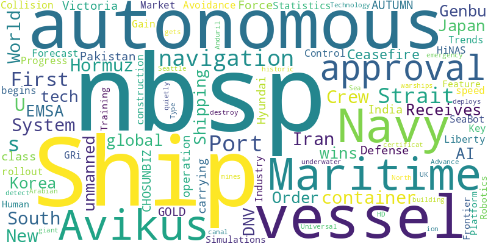

# News Report

- Window: `2026-04-06` to `2026-04-12`
- Sources queried: Chosunbiz, EMSA - European Maritime Safety Agency, Engineering and Technology Magazine, GeekWire, IndexBox, Marine Insight, Marine Link, Marine Technology News, PressReader, Shipping Telegraph, Smart Maritime Network, The Defence Blog, The Defense Post, The Maritime Executive, Victoria News, gCaptain, shipmanagementinternational.com, vocal.media, 아시아경제
- Items in report: 30

## Executive Summary

Global advancements in autonomous maritime technology dominated developments, with key regulatory approvals and certifications—including Japan’s *Genbu*, South Korea’s HiNAS, and HD Hyundai Avikus’ universal navigation system—accelerating commercial and defense adoption. The autonomous ships market is projected to expand significantly by 2033, driven by AI-driven collision avoidance and efficiency gains, while defense sectors, including the U.S., UK, and Anduril, are integrating unmanned vessels for mine countermeasures and naval operations. Sustainability efforts gained traction with India’s first methanol bunkering trial, MEYER WERFT’s battery-electric cruise ship concept, and emissions reduction initiatives, though environmental setbacks like the Port of Antwerp oil spill underscored ongoing challenges. Geopolitical tensions persisted in the Strait of Hormuz, where Iran’s vessel restrictions and alleged tolls disrupted shipping, while humanitarian and safety incidents—such as the Pakistan Navy’s rescue of distressed crews and labor abuses on the *BBG Wuzhou*—highlighted regulatory and operational risks in the maritime industry. Record-breaking ship orders and port expansions, including Port Tampa Bay’s largest container vessel, reflected robust demand in global trade despite regional disruptions.

## Week's Trend

## Table of Contents

### Ship Autonomy
1. [Autonomous Ship Progress: Japan's Genbu & South Korea's HiNAS Gain Key Approvals - News and Statistics](#63957bbfc5c018c870840c32758ba349b398aadce699e5653f0c2f29116a8a45)
2. [Autonomous Ships Market Trends: Collision Avoidance, AI Control Systems & Industry Forecast to 2033](#84b331bdf9631827280d616376f60b2dc9b0dafffd2a312eb815afc1f9fd8bb0)
3. [Liberty class autonomous ship construction for the US navy begins](#89c17ce716cd11f02bc3c5b8181a137f751dfba78046cd1d1f0083df91483ada)
4. [Avikus wins DNV approval to speed global rollout of autonomous ship tech - CHOSUNBIZ](#e9066c9fba58f049abea44568b4511c1c7a608a24e3e3e206b78310fbb039f5b)
5. [SeaBot Maritime, GRi Simulations and Frontier Robotics Feature Human-AI Autonomous Maritime Training Platform](#9119f83250d593c78af4ce5f9abe68481441c4d430c2776df85a5bce1a9997f7)
6. [Avikus gets DNV approval for autonomous navigation tech](#28a7735fc0ff077a74db32fe2cd68690540c6c6001b58fa2adfa0cafa6681282)
7. [Japan and South Korea Advance Autonomous Navigation](#abe66687912a5310a8c2ad0b37df899a85b9ece8dcb2a73eb8ac0ae06c5808b8)
8. [Defense giant Anduril is quietly building autonomous warships on Seattle's historic ship canal](#1cca25094b8c59347b742f010d890dfd3be3ad948ba4ce4b68dc60d7e8fc5f74)
9. [UK deploys autonomous vessel to detect and destroy underwater mines](#c169d88ced65d956fbdc1acbc0cdd9b39800743ca2b9ff53491d6fdea2d7b74d)
10. [HD Hyundai Avikus Receives World's First Type Approval for Universal Autonomous Navigation System](#5ab40e8d64407788b05c33a7f742c1cafcc84daa09e73558a367689aa6f88226)
11. [Avikus wins certificat­ion for autonomous navigation](#ece67e022a1b5906fc68b2bf931a66a1bc7128d06760e5ace2e686b8106f0510)
12. [Pakistan Navy Rescues 18 Crew From Distressed Ship GOLD AUTUMN In North Arabian Sea](#3997750d1e4a0d1b8929e91ef2f73b5a62c1f451dd9666b14c0c920ab13a86ee)
13. [Pakistan Navy Evacuates Merchant Ship Crew](#bcb5d7fc7f9f08c6dac69753ccbe462847c2f07bf0591c5323dc8e4c9dee3b98)
14. [AMSA Bans Liberia-Flagged Ship from Australian Ports After 7 Months Of Unpaid Wages & Crew Exploitation](#552bae0d7161dc06eb1bb3450e572e6824b5d2f3bc2dbeccba8211f202617f1f)
15. [Company envisions autonomous ferry connecting Greater Victoria communities](#bc023c7e076e644d3e1102d8c6ab43cad8aac7d730629eded12f48c44b1e309b)
16. [ClassNK awards world’s first MASS notation to domestic container ship ‘Genbu’ — SMI DIGITAL](#ce4b668620f443bac7b2b98ee9a1f39ade2eba7b50bdba5f30d0f03995ad575e)
17. [Global Ship Order Book Hits 17-Year High as Tanker Orders Surge](#b6e8c543c376c9403c19330158d8cc338e191b79559a3c072dd1bf278da39cdd)
18. [U.S. Special Forces tests FOG unmanned vessel in Spain](#3f2b41ff13d3b2118c9335b371d1c810e4b90ded09c90d40ae820b429b3ad36d)
19. [Royal Navy Receives Second Unmanned Minehunting Vessel](#338ef202e7a656310e5cbda6d2e31b6af2b53b3bb7c894a35f5292f146d13dfa)
20. [Fire On South Korean Navy Submarine Kills Worker During Maintenance At Hyundai Shipyard](#5378524ae7eac5dbb5f1055b3579a1451ff7fad00eb0fad73ba3982c76dd7e5e)
21. [India Conducts First Shore-to-Ship Methanol Bunkering At Kandla Port](#54c349ce3ea348c98bfb8a091d134768861144b74016adcdcc57c137645da45f)
22. [World’s First 100% Battery-Electric Cruise Ship Concept Unveiled By MEYER WERFT](#e07bc7c81949f1c5eabc042df2c6e2e9d5a5e0ac6dd6021185731035a95325a0)
23. [EU Rejects Trump’s “Joint Venture” With Iran To Introduce Pay-To-Pass System In Strait Of Hormuz, Calls It Illegal](#a34a47938ef9b5086b3c2689c943b027c827c24a85be353698bd839a2133116f)
24. [Indian Navy Launches Emergency Mission To Rescue 18 Stranded Ships In Persian Gulf](#ca2839c1bd774c084e5cfdbddb0ea25382d833c65ec96a409925c833ba30ef04)
25. [Oil Spill At Port Of Antwerp Halts Shipping Operations & Spreads To Doelpolder Wetlands](#1208bcf8b6dc6ddda8047174f1250f071f8af335f3dc290cfc3a349f3a5fed1d)
26. [Port Tampa Bay Welcomes Container Vessel with Largest Carrying Capacity](#ff0c9ba35ae6ac0d70c183b8205802f8bcae8450b789caa542950b75232f3625)
27. [EMSA OPR Vessels, EAS and MAR-ICE - Activities Report 2025. Sustainability and Technical Assistance - EMSA](#2ca87371f6e794b6cd67b195d8bb087b803a930a60db17b86ad1caaf62e56112)
28. [Iran Allows Only 15 Ships To Cross Strait Of Hormuz Daily Per The Ceasefire Agreement](#ac7b503984cf186eb3cf6736648f930fa99cbfaf9152cda7debdc168b1deb02c)
29. [Just 12 Ships Cross Strait Of Hormuz After US-Iran Ceasefire; Trump Alleges Iran Charging Tolls](#568b0872aca0028e4dee54b136ab939c87814a4c4b82c3f8659ffb6febbd3ccc)
30. [Maryland Secures Settlement With Cargo Ship Owners Over Baltimore Bridge Collapse That Killed 6](#da2d897fed5e5fc3cb98a68a1e372c798bbc73f25ef20017368ddc670f12433a)

## Ship Autonomy

 
---
 

### Autonomous Ship Progress: Japan's Genbu & South Korea's HiNAS Gain Key Approvals - News and Statistics

**Metadata**

- Date: 2026-04-08
- Authors: IndexBox
- DOI: N/A
- Link: https://news.google.com/rss/articles/CBMiogFBVV95cUxPNXFOaVhhUncwdVlwQ3VsLV9vSDFkcHFobXctNnJJREZpdWZMTHk5VzdUMzJKalN1bTBVY2dOTHlZUG10b3JwZ0xfWUdXTU5wNEN1Q1lncjhwZFhIWGlibS1kYks2SFdrTHhjVGVISEd5RTFhRl9vdWdDSUJ2dnlHLS1YVmo3Y0p1RDlTQjRwZ3FZN3hpWUtjTUZtb3hGNEpRaEE?oc=5
- Relevance: 13.0 (46%)

**AI Summary**

Japan’s autonomous ship system, Genbu, and South Korea’s HiNAS have received key regulatory approvals in 2026. These approvals mark significant progress in the development and deployment of autonomous maritime technology. Both systems are advancing toward operational use in commercial shipping. The article highlights recent milestones and related statistics in autonomous ship adoption.

 
---
 

### Autonomous Ships Market Trends: Collision Avoidance, AI Control Systems & Industry Forecast to 2033

**Metadata**

- Date: 2026-04-08
- Authors: vocal.media
- DOI: N/A
- Link: https://news.google.com/rss/articles/CBMixwFBVV95cUxNd1ozeHZPV05vYzBDYmhNYUs4dVRLeVRrYy11U055ckwxRFN4dmZJZHRadVVTLVZON3dKeExGUjdWdFMxYlRFamkzZHM1NEcyWjZkNUt5bmlJM0QwTTlmSDdDbl96dU8zUlp2SzM2NTdwRWpaZWN0dE5xdHFuT2dnY2Zwam43LU9ESU5nSXhOY0YwQXJHMTI0TWU0SEgxcG9WaFpmckdUanRPd2tqakVTdHAtOXpvaExFVUNIWGxCSDdwNmJqX0JB?oc=5
- Relevance: 13.0 (46%)

**AI Summary**

The autonomous ships market is projected to grow significantly by 2033, driven by advancements in collision avoidance and AI control systems. Key trends include increased adoption of automation to improve maritime safety and efficiency. The report highlights industry forecasts, emphasizing the role of AI in enhancing navigation and operational decision-making. Market expansion is expected across commercial and defense sectors.

 
---
 

### Liberty class autonomous ship construction for the US navy begins

**Metadata**

- Date: 2026-03-31
- Authors: Shipping Telegraph
- DOI: N/A
- Link: https://news.google.com/rss/articles/CBMisgFBVV95cUxNeU1XTlN2YXpmQUx3NXN5TkVFQzVJT3JIa0k0eFJBa3JYa3RIQUtmRG5tNWgzaTBqS1FVU21KbGhTaUZkaTl5anlJRGpwWHNDaXFabnBTVEN2dFZmbzkyZ19GZmtMdDdheFZuUndHZENvc3Z1aGlDWU1TRGNra3pVYVJnVWNJZGRrREw0dGNWem9KcXJRblVSbEFuNnhKWDJ3RUpZUjNZb3FLOXF0R0tNUFJR?oc=5
- Relevance: 13.0 (46%)

**AI Summary**

Construction of the US Navy’s Liberty-class autonomous ships has started as of March 2026. The vessels are designed to operate without a crew, enhancing naval capabilities. This initiative marks a shift toward increased automation in maritime operations. Details on specific timelines or shipyard locations were not provided.

 
---
 

### Avikus wins DNV approval to speed global rollout of autonomous ship tech - CHOSUNBIZ

**Metadata**

- Date: 2026-04-07
- Authors: Chosunbiz
- DOI: N/A
- Link: https://news.google.com/rss/articles/CBMiggFBVV95cUxOX3RwM2hNRWxFcC1zdHdjWEo0SzJ4QXNKenhuamg1RWdxQnpRWlduWXROeWpHUkhlWUV3dkR2VURVd21COC1pTW9ybDNLVnFaMGpKU3dOYkNnTXdOQjRKVVZZaXVHX0VOdG9CUU1LZEE5TTdOOUFxUk0zYUd5UjExZE9R0gGWAUFVX3lxTE1idGhpMjNwY3ZmWTN2dzNSMC1Eczl2M2ZUZ2ozb0k3MzVWYy1UTS11ZUZRUFJCdjNaV1J3TnN4NGthMFI4R1N4SXlOQ0VwaGU5VWNZaG1WWVNPUFZTYzdPYXdUazhUUFR2TEc3aGZxVjRGV0JGZ3VFZktUX2RscTItTktFRFpRS2hya3Bvb1NIcGswem5xZw?oc=5
- Relevance: 11.5 (41%)

**AI Summary**

Avikus received approval from DNV, a leading classification society, to accelerate the global deployment of its autonomous ship technology. This certification supports the company’s efforts to expand its self-navigating systems in the maritime industry. The approval is expected to facilitate faster adoption and regulatory acceptance of autonomous vessels worldwide. The development marks a significant step in advancing automated shipping solutions.

 
---
 

### SeaBot Maritime, GRi Simulations and Frontier Robotics Feature Human-AI Autonomous Maritime Training Platform

**Metadata**

- Date: 2026-04-10
- Authors: Marine Technology News
- DOI: N/A
- Link: https://news.google.com/rss/articles/CBMijgFBVV95cUxPRkVEV3h0eE5LZVpTQVFmNlNfZy1salJONUxtNTE1dGxJeEx2YnZvQTl1MnQ1SEp3QURacEJsUURfVTJZQ0pxRTFVbDFLVGdCT1RTbmt3LVE2X0NmSEFMNmxuLXZCUHRPVndiblBfek16VWRPeVljVHNRZHExcnoxNWxGY3hieGMwOE5zakVR?oc=5
- Relevance: 11.0 (39%)

**AI Summary**

SeaBot Maritime, GRi Simulations, and Frontier Robotics collaborated to develop a human-AI autonomous maritime training platform. The platform aims to enhance training for maritime operations by integrating artificial intelligence. It was featured in a demonstration highlighting its capabilities. The system is designed to improve efficiency and safety in maritime environments.

 
---
 

### Avikus gets DNV approval for autonomous navigation tech

**Metadata**

- Date: 2026-04-07
- Authors: Smart Maritime Network
- DOI: N/A
- Link: https://news.google.com/rss/articles/CBMiogFBVV95cUxOa1lpTXdtLWxVNkxZN0xGR3RneF94YVdkbTdOTFhtSTZHRENOZVVhRGNqWmg0SDB1RENxbDdBNkNfXzY1dUU3TTZuMm1URWJLZ3ZpYUg5X1dPeVlfdnVuaTFfMVcyclNUeUg5UWh4X2ZEOEpwQkhmdGl2TnlKRURLeU9RSHJraEJpdXhMM185VmZaOXlKTnJmRDRGYkZyT3hkVVE?oc=5
- Relevance: 10.5 (38%)

**AI Summary**

Avikus received approval from DNV for its autonomous navigation technology. The certification validates the system's compliance with maritime safety and performance standards. This approval marks a step toward broader adoption of autonomous shipping solutions. The technology aims to enhance navigation efficiency and reduce human error in maritime operations.

 
---
 

### Japan and South Korea Advance Autonomous Navigation

**Metadata**

- Date: 2026-04-07
- Authors: The Maritime Executive
- DOI: N/A
- Link: https://news.google.com/rss/articles/CBMilAFBVV95cUxPc0JOOGZyU3VWRmxzSnJUZXIwZ0VnR1JjbGdtZVc5Y3puX0RSUnNaNjBkeFF6OWh6Q1NkcTBfOWRaVktYOFpBb2Vnb25fRDRneVJ2WEpvc1pFU2N0Q25fempHZzBIeDZSdDZNbmxfNlQtNDlsTkhydV8wcDJnR0ZlRVUzMVRoTVlGcjZlbHdvN2l0WnN6?oc=5
- Relevance: 10.5 (38%)

**AI Summary**

Japan and South Korea are progressing in autonomous navigation technology for maritime applications. Both countries are developing systems to enhance ship safety and operational efficiency. The advancements aim to reduce human error and improve navigation in challenging conditions. Collaborative efforts and regulatory frameworks are being established to support these innovations.

 
---
 

### Defense giant Anduril is quietly building autonomous warships on Seattle's historic ship canal

**Metadata**

- Date: 2026-04-08
- Authors: GeekWire
- DOI: N/A
- Link: https://news.google.com/rss/articles/CBMiwgFBVV95cUxOY1hIVEczdHZlZ3RKa1lSRWo3b0VYUktVVUlybHlxaUNJMVI4cTloVEJpejl6ekM3Q0R2bmVkVjBVTTJjUlhRZ2pCNGV5eEg3RUtxamhXWnlTYjAtb2RwSHBIRHNOa05TdnAxX2stZWRWX3YwOXo4aWcwc01zV21jQTF1U2tPSmpxdXZiajI4blowQ3FUQm9XSDNlT1NCbjFmbzhFZVZvMU9HQUJYeDdSMzRPRlFUb2UxMEJIOTE1NDNTUQ?oc=5
- Relevance: 10.0 (36%)

**AI Summary**

Anduril, a major defense contractor, is constructing autonomous warships in Seattle’s historic ship canal. The project is being carried out discreetly, with few public details available. The company specializes in advanced military technology, including AI-driven systems. The initiative reflects Anduril’s expansion into unmanned naval capabilities.

 
---
 

### UK deploys autonomous vessel to detect and destroy underwater mines

**Metadata**

- Date: 2026-04-08
- Authors: Engineering and Technology Magazine
- DOI: N/A
- Link: https://news.google.com/rss/articles/CBMitAFBVV95cUxNT0ZXcDM1RXBnS1RYcTlXVjh1bXdWeHRJbGVsRjRKakM2YkMyLXFVZktxU25RbXlPSlZsVGFnR1cyRDFNeEduVUljc3UwZnA4T28wajVCTDBDQlQwMXN3UUtWQ3FEeWttZjZDZXFxc0h6UmVycThNd2VwdzRzRUtLYkJDRzVnRG5PbXJYMS1EZXhTOEtwczdCYzVOdm10VzNwWVVWVVcwQThKWDM0N3cteVg0a0M?oc=5
- Relevance: 10.0 (36%)

**AI Summary**

The UK has deployed an autonomous vessel designed to detect and destroy underwater mines. This unmanned system aims to enhance naval safety and operational efficiency. The technology reduces risks to human divers and crewed ships. The initiative reflects advancements in maritime defense automation.

 
---
 

### HD Hyundai Avikus Receives World's First Type Approval for Universal Autonomous Navigation System

**Metadata**

- Date: 2026-04-07
- Authors: 아시아경제
- DOI: N/A
- Link: https://news.google.com/rss/articles/CBMiZEFVX3lxTE1VQzlsUE5kc3RDdXd2bjNidnVkakhZU243U1ZWSXR4azlaeTFyQ3pEMnhOTGdUWVAyRTBvMUF4QmNxb2xHc1RVWklZeDNlM3M1S3QyTXA0VUM3Y1ZnVXR2d0syTVg?oc=5
- Relevance: 10.0 (36%)

**AI Summary**

HD Hyundai Avikus received the world’s first type approval for a universal autonomous navigation system on April 7, 2026. The certification, granted by a classification society, validates the system’s compliance with international maritime safety standards. This approval allows the technology to be installed on various vessel types without additional testing. The system aims to enhance autonomous shipping operations globally.

 
---
 

### Avikus wins certificat­ion for autonomous navigation

**Metadata**

- Date: 2026-04-07
- Authors: PressReader
- DOI: N/A
- Link: https://news.google.com/rss/articles/CBMikgFBVV95cUxPYkw4NWVGa2VIdmdrSHl4aGpQWDZFbEI1bUJ6RW9FOXBzWHZ4Y1RmekdtQTctM2Z4eEc0WjhaNWZGWk5QRGdLaV9FQjVtcHZ3eXR6UGltZ2VwTmxySjV0clpyRGtjVXlsOTFQcEVjZk1tRzh6V2VlWDROQkR5S2llbXdiNjVWVVlHQXN4ZXJ2N0E2Zw?oc=5
- Relevance: 8.5 (30%)

**AI Summary**

Avikus received certification for its autonomous navigation technology in April 2026. The achievement marks a milestone for the company’s self-steering systems. No further details on the certification scope or testing process were provided. The development signals progress in maritime automation.

 
---
 

### Pakistan Navy Rescues 18 Crew From Distressed Ship GOLD AUTUMN In North Arabian Sea

**Metadata**

- Date: 2026-04-11
- Authors: Marine Insight
- DOI: N/A
- Link: https://www.marineinsight.com/pakistan-navy-rescues-18-crew-from-distressed-ship-gold-autumn-in-north-arabian-sea/?utm_source=rss&utm_medium=rss&utm_campaign=pakistan-navy-rescues-18-crew-from-distressed-ship-gold-autumn-in-north-arabian-sea
- Relevance: 7.5 (27%)

**AI Summary**

The Pakistan Navy rescued 18 crew members from the distressed ship *MV Gold Autumn* in the North Arabian Sea. The vessel sent an emergency alert, leading to a coordinated maritime response. The incident occurred on April 11, 2026. No further details on the cause of distress were provided.

 
---
 

### Pakistan Navy Evacuates Merchant Ship Crew

**Metadata**

- Date: 2026-04-10
- Authors: Marine Link
- DOI: N/A
- Link: https://www.marinelink.com/news/pakistan-navy-evacuates-merchant-ship-537934
- Relevance: 7.0 (25%)

**AI Summary**

The Pakistan Navy rescued 18 crew members from the merchant vessel *Gold Autumn* in the North Arabian Sea following a distress call. The crew included nationals from China, Bangladesh, Myanmar, Vietnam, and Indonesia. All rescued individuals were safely evacuated and transported. The incident occurred in April 2026.

 
---
 

### AMSA Bans Liberia-Flagged Ship from Australian Ports After 7 Months Of Unpaid Wages & Crew Exploitation

**Metadata**

- Date: 2026-04-10
- Authors: Marine Insight
- DOI: N/A
- Link: https://www.marineinsight.com/amsa-bans-liberia-flagged-ship-from-australian-ports-after-7-months-of-unpaid-wages-crew-exploitation/?utm_source=rss&utm_medium=rss&utm_campaign=amsa-bans-liberia-flagged-ship-from-australian-ports-after-7-months-of-unpaid-wages-crew-exploitation
- Relevance: 6.0 (21%)

**AI Summary**

The Australian Maritime Safety Authority (AMSA) banned the Liberia-flagged ship *BBG Wuzhou* from Australian ports after discovering seven months of unpaid wages and crew exploitation. The vessel was inspected upon docking in Newcastle, revealing these violations. The ban follows AMSA’s enforcement actions against labor abuses in the maritime industry. No further details on crew conditions or company response were provided.

 
---
 

### Company envisions autonomous ferry connecting Greater Victoria communities

**Metadata**

- Date: 2026-04-07
- Authors: Victoria News
- DOI: N/A
- Link: https://news.google.com/rss/articles/CBMiqgFBVV95cUxOSW5EX3JfWEhsN0dsbW1RWkVtRnc5d01lUV92dVR0OFA3RC13S19BRkFiTkpGR1FuSkpWTDZLRWFhMVZzTjh0TDFFU0NZQkUwNU9pQUJtVFdzTWFIQ1NtUENvSzZqYTdBNWRjWmV4anNXbmQ4Mm1XcXJiZ2xZbGpqU2t1c1ZzTUdtNHV3Q28tOXZMR1lKVEZIOW8wSVh6d2FTdER0UHpOZkd0QQ?oc=5
- Relevance: 6.0 (21%)

**AI Summary**

A company plans to introduce an autonomous ferry service to connect communities in Greater Victoria by 2026. The proposed system aims to improve transportation efficiency and reduce reliance on traditional ferry routes. No specific technical details or operational timelines beyond the vision have been confirmed. The project is still in the conceptual phase.

 
---
 

### ClassNK awards world’s first MASS notation to domestic container ship ‘Genbu’ — SMI DIGITAL

**Metadata**

- Date: 2026-04-07
- Authors: shipmanagementinternational.com
- DOI: N/A
- Link: https://news.google.com/rss/articles/CBMikgJBVV95cUxQWFFmTXpxWnJRYzFPakpHMVpLRXFEYi1ITHU5VkVYbVFtdFdmcXAwSUw0Y2U1dUJNNW1pdWR4UmNnT1lCWHdzWEhWbzB1Y1VEdUk2ZU9VczA1c2lKMnpoOFZDZzN1M1dIeG92UHZRdHdQVm9DeFNjMWN3eTNxbEVYeXdnUUhaOXkxMi1UVlJMS0JuWjNlSWtnVjN3YnQzV1o2cDUycE0zekhmc2c1UWhCRm54NkpfNVJLSjZaYWZLUU13WFRaUURVQkROSUNSc1NTaURuMkdlM3RXS3RDTF9pT1Z5Z1ktZlJYQTVsY3hqNGc1cnBMVTFrV1pqbTFNMWxBQ244bmU0a3pra0JnYU9FWUpB?oc=5
- Relevance: 5.5 (20%)

**AI Summary**

ClassNK granted the world’s first Maritime Autonomous Surface Ship (MASS) notation to the domestic container ship *Genbu*. The notation certifies the vessel’s compliance with autonomous shipping standards. This milestone marks progress in integrating autonomous technology into commercial maritime operations. The ship is operated by a Japanese company.

 
---
 

### Global Ship Order Book Hits 17-Year High as Tanker Orders Surge

**Metadata**

- Date: 2026-04-09
- Authors: gCaptain
- DOI: N/A
- Link: https://news.google.com/rss/articles/CBMijgFBVV95cUxPRnNoang0TDg1MC1VanZiQ3FkVzBpLXl6YXU2eGVyRjg4WVBfWGl0QUxhV29qRGJLd0ZtTm1KYVQyckVBQ05aMTlNUmFwLWh5RUhSM284SWhUQUVzYmdkN0hQQl9Vc2NKVkVZakk1MWpERkpMUzYxdHdhdEI4cXYwYWNteHQyb3ZLT0xsVkFR?oc=5
- Relevance: 5.0 (18%)

**AI Summary**

The global ship order book reached its highest level in 17 years, driven by a surge in tanker orders. This increase reflects strong demand in the shipping industry. The trend indicates growing confidence in future maritime trade. Tanker orders specifically saw significant growth.

 
---
 

### U.S. Special Forces tests FOG unmanned vessel in Spain

**Metadata**

- Date: 2026-04-09
- Authors: The Defence Blog
- DOI: N/A
- Link: https://news.google.com/rss/articles/CBMihgFBVV95cUxPNDNzUzVNWFMxdFBHWm1oVmNBc1ZLekl0YXQzdEN4WGduci1rNldWQkpHSGI3SWpaeUF6d1p4b2JkUHdMcm5VVkVCSjMxUEp2cURVaFFaWC1tWjh0ZnNaaXNUUXNlcE5CY0hVU0VGaXdQZ25HWnlBLWxkbHRMY0JidEF3RENfZ9IBiwFBVV95cUxOWGR4SDZsSnBhN2w2cFB2YjFteVFVc2RJa3oyMU8xSXBDMVVWMWJxcXhSLXM2anpUaVhjRDFxbWJocERSNnRSc3dFSlptSWY3WUREMEt6bWlYdFJDTElJcVVoaTBaMUwtLXQ1OGlrNjBWM2JwWlVHbGdNd1dfdUhCWDVDakZFV19SSWtF?oc=5
- Relevance: 5.0 (18%)

**AI Summary**

U.S. Special Forces conducted tests of the FOG unmanned vessel in Spain in April 2026. The trials focused on evaluating the vessel's capabilities for potential military applications. No specific results or operational details were disclosed in the report. The tests were documented by The Defence Blog.

 
---
 

### Royal Navy Receives Second Unmanned Minehunting Vessel

**Metadata**

- Date: 2026-04-07
- Authors: The Defense Post
- DOI: N/A
- Link: https://news.google.com/rss/articles/CBMieEFVX3lxTFBDU0pwZk5LWWg0MHMzRnV6VnZNVV9HbDV2NmNrUlA2M0FrZDhtOTVIWEtVZ1NLUnRXdmI1R0ludEtrZm8ybW5Ob2Y0b3dUanR0YjlOMDRXTUVTTGZScUJGOHFNUmJEdHBlaExhd2dZQzFUZW1uNkNaadIBfkFVX3lxTFB1SDdLdC1fdHJUWHU0Tkk3MWhXNHBsaS1MOWpCXzJzQ05RMDlVeUJwRTctVzhPQmpBbFlGblh4aGZXRm5MRHBYc1FnQ1U4eC1zOVhyN3dkcTJZYXhkUTU0aFgzSXl2bWRncF9GdzJOeXR0RlJxYnlNWXBIcl9IQQ?oc=5
- Relevance: 5.0 (18%)

**AI Summary**

The Royal Navy has taken delivery of its second unmanned minehunting vessel. This addition strengthens its fleet of autonomous systems designed for detecting and neutralizing naval mines. The vessel is part of a broader effort to modernize mine countermeasure capabilities. No specific operational details or timelines were provided in the announcement.

 
---
 

### Fire On South Korean Navy Submarine Kills Worker During Maintenance At Hyundai Shipyard

**Metadata**

- Date: 2026-04-11
- Authors: Marine Insight
- DOI: N/A
- Link: https://www.marineinsight.com/fire-on-south-korean-navy-submarine-kills-worker-during-maintenance-at-hyundai-shipyard/?utm_source=rss&utm_medium=rss&utm_campaign=fire-on-south-korean-navy-submarine-kills-worker-during-maintenance-at-hyundai-shipyard
- Relevance: 4.5 (16%)

**AI Summary**

A fire broke out on April 9 at 1:58 p.m. during maintenance work on the South Korean Navy submarine *Hong Beom-do*, a Sohn Won-yil-class vessel, at a Hyundai shipyard. The incident resulted in the death of a worker. The submarine was undergoing routine maintenance at the time. No additional details on the cause or extent of the fire were provided.

 
---
 

### India Conducts First Shore-to-Ship Methanol Bunkering At Kandla Port

**Metadata**

- Date: 2026-04-11
- Authors: Marine Insight
- DOI: N/A
- Link: https://www.marineinsight.com/india-conducts-first-shore-to-ship-methanol-bunkering-at-kandla-port/?utm_source=rss&utm_medium=rss&utm_campaign=india-conducts-first-shore-to-ship-methanol-bunkering-at-kandla-port
- Relevance: 4.5 (16%)

**AI Summary**

India conducted its first shore-to-ship methanol bunkering at Kandla Port as part of its maritime emissions reduction strategy. The trial supports the country’s goal of achieving net-zero emissions by 2050. This initiative aims to promote cleaner fuel alternatives in the shipping industry. The effort aligns with broader sustainability targets for the maritime sector.

 
---
 

### World’s First 100% Battery-Electric Cruise Ship Concept Unveiled By MEYER WERFT

**Metadata**

- Date: 2026-04-11
- Authors: Marine Insight
- DOI: N/A
- Link: https://www.marineinsight.com/worlds-first-100-battery-electric-cruise-ship-concept-unveiled-by-meyer-werft/?utm_source=rss&utm_medium=rss&utm_campaign=worlds-first-100-battery-electric-cruise-ship-concept-unveiled-by-meyer-werft
- Relevance: 4.5 (16%)

**AI Summary**

MEYER WERFT unveiled the world’s first 100% battery-electric cruise ship concept. The vessel will measure over 80,000 gross tonnage and accommodate 1,856 passengers. No fossil fuels will be used for propulsion or onboard operations. The design aims to set a new standard for sustainable maritime travel.

 
---
 

### EU Rejects Trump’s “Joint Venture” With Iran To Introduce Pay-To-Pass System In Strait Of Hormuz, Calls It Illegal

**Metadata**

- Date: 2026-04-11
- Authors: Marine Insight
- DOI: N/A
- Link: https://www.marineinsight.com/eu-rejects-trumps-joint-venture-with-iran-to-introduce-pay-to-pass-system-in-strait-of-hormuz-calls-it-illegal/?utm_source=rss&utm_medium=rss&utm_campaign=eu-rejects-trumps-joint-venture-with-iran-to-introduce-pay-to-pass-system-in-strait-of-hormuz-calls-it-illegal
- Relevance: 4.0 (14%)

**AI Summary**

The EU rejected a proposal by Trump for a "joint venture" with Iran to implement a pay-to-pass system in the Strait of Hormuz, declaring it illegal. Ship traffic through the strait remains restricted, with only a few vessels successfully navigating the area in recent days. The article highlights concerns over the legality and impact of the proposed system. No further details on vessel numbers or enforcement were provided.

 
---
 

### Indian Navy Launches Emergency Mission To Rescue 18 Stranded Ships In Persian Gulf

**Metadata**

- Date: 2026-04-11
- Authors: Marine Insight
- DOI: N/A
- Link: https://www.marineinsight.com/indian-navy-launches-emergency-mission-to-rescue-18-stranded-ships-in-persian-gulf/?utm_source=rss&utm_medium=rss&utm_campaign=indian-navy-launches-emergency-mission-to-rescue-18-stranded-ships-in-persian-gulf
- Relevance: 4.0 (14%)

**AI Summary**

The Indian Navy and a multi-ministry task force launched an emergency mission to rescue 18 ships stranded in the Strait of Hormuz. These vessels were carrying cargo destined for India. The operation aims to evacuate the ships from the Persian Gulf region. The mission was initiated on April 11, 2026.

 
---
 

### Oil Spill At Port Of Antwerp Halts Shipping Operations & Spreads To Doelpolder Wetlands

**Metadata**

- Date: 2026-04-11
- Authors: Marine Insight
- DOI: N/A
- Link: https://www.marineinsight.com/oil-spill-at-port-of-antwerp-halts-shipping-operations-spreads-to-natural-wetlands/?utm_source=rss&utm_medium=rss&utm_campaign=oil-spill-at-port-of-antwerp-halts-shipping-operations-spreads-to-natural-wetlands
- Relevance: 4.0 (14%)

**AI Summary**

A major oil spill at the Port of Antwerp disrupted shipping operations after occurring during a bunkering procedure on the container ship *MSC Denmark VI*. The spill spread beyond the port, reaching the nearby Doelpolder wetlands. Authorities halted all shipping activities in response to the incident. The extent of environmental impact is under assessment.

 
---
 

### Port Tampa Bay Welcomes Container Vessel with Largest Carrying Capacity

**Metadata**

- Date: 2026-04-10
- Authors: Marine Link
- DOI: N/A
- Link: https://www.marinelink.com/news/port-tampa-bay-welcomes-container-vessel-537942
- Relevance: 4.0 (14%)

**AI Summary**

Port Tampa Bay set a new record by welcoming the *ZIM Canada*, a container vessel with a carrying capacity of 11,900 TEUs. This surpasses the port’s previous record by nearly 2,000 TEUs. The arrival marks the largest container ship ever handled at Port Tampa Bay. The milestone reflects the port’s growing capacity for larger vessels.

 
---
 

### EMSA OPR Vessels, EAS and MAR-ICE - Activities Report 2025. Sustainability and Technical Assistance - EMSA

**Metadata**

- Date: 2026-04-10
- Authors: EMSA - European Maritime Safety Agency
- DOI: N/A
- Link: https://news.google.com/rss/articles/CBMi5gFBVV95cUxOX0RxREdRSVFGSG9EeXNfOEcxdnBwVUVFNEMzSUp0c2tKTTVhZ3NBSVVVeFBfcVZVN20yUUk0MFBDdDJMLTVSWU1Da2NxYkMzMUhOX0hGbGZ6dFVyazRHMXZhYi1WdURoTWtnTWptNV9YUDM5aldaeE4wSVNtaDI4NXhEUDJtSTg5cnFDVUlneS03UlFBYXg5RXhTN192Z3RTcDdLOE9teDVoeWp2NnJTOURlc20yMkxITHp3bmZGWks2dFlwOEk3NDdkQXVMMnBNOFE0VWtPZm1PME5mdGN4bXhlMFZuUQ?oc=5
- Relevance: 3.5 (12%)

**AI Summary**

The 2025 Activities Report from the European Maritime Safety Agency (EMSA) details operations of OPR Vessels, the European Assistance Service (EAS), and the MAR-ICE network. It highlights sustainability efforts and technical support provided to EU member states in maritime safety and pollution response. The report covers key activities, performance metrics, and advancements in maritime assistance. EMSA’s role in coordinating emergency responses and improving maritime infrastructure is emphasized.

 
---
 

### Iran Allows Only 15 Ships To Cross Strait Of Hormuz Daily Per The Ceasefire Agreement

**Metadata**

- Date: 2026-04-10
- Authors: Marine Insight
- DOI: N/A
- Link: https://www.marineinsight.com/iran-allows-only-15-ships-to-cross-strait-of-hormuz-daily-per-the-ceasefire-agreement/?utm_source=rss&utm_medium=rss&utm_campaign=iran-allows-only-15-ships-to-cross-strait-of-hormuz-daily-per-the-ceasefire-agreement
- Relevance: 3.0 (11%)

**AI Summary**

Iran has restricted shipping in the Strait of Hormuz to 15 vessels per day under a ceasefire agreement. The limitation remained in effect despite the truce between Iran and the United States. The measure was implemented following recent tensions in the region. No further details on enforcement or duration were provided.

 
---
 

### Just 12 Ships Cross Strait Of Hormuz After US-Iran Ceasefire; Trump Alleges Iran Charging Tolls

**Metadata**

- Date: 2026-04-10
- Authors: Marine Insight
- DOI: N/A
- Link: https://www.marineinsight.com/just-12-ships-cross-strait-of-hormuz-after-us-iran-ceasefire-trump-alleges-iran-charging-tolls/?utm_source=rss&utm_medium=rss&utm_campaign=just-12-ships-cross-strait-of-hormuz-after-us-iran-ceasefire-trump-alleges-iran-charging-tolls
- Relevance: 3.0 (11%)

**AI Summary**

Only 12 ships crossed the Strait of Hormuz following the US-Iran ceasefire announced on April 8, 2026, according to Kpler data. The low traffic contrasts with previous levels of maritime activity in the region. President Trump alleged that Iran is imposing tolls on vessels passing through the strait. The article does not provide further details on toll claims or verification.

 
---
 

### Maryland Secures Settlement With Cargo Ship Owners Over Baltimore Bridge Collapse That Killed 6

**Metadata**

- Date: 2026-04-10
- Authors: Marine Insight
- DOI: N/A
- Link: https://www.marineinsight.com/maryland-secures-settlement-with-cargo-ship-owners-over-baltimore-bridge-collapse-that-killed-6/?utm_source=rss&utm_medium=rss&utm_campaign=maryland-secures-settlement-with-cargo-ship-owners-over-baltimore-bridge-collapse-that-killed-6
- Relevance: 3.0 (11%)

**AI Summary**

Maryland reached a settlement with the owners of the cargo ship responsible for the Baltimore bridge collapse in 2026. The agreement covers compensation for the destroyed bridge, lost revenue, environmental damage, and broader economic losses. The collapse had previously resulted in six fatalities. No further details on the settlement amount or terms were disclosed.
