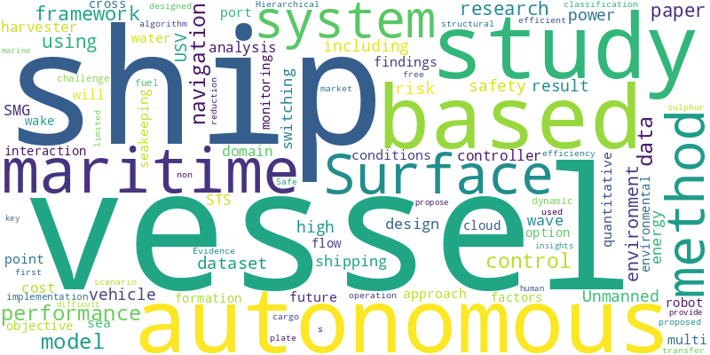

# Papers Report

- Window: `2026-04-06` to `2026-04-12`
- Sources queried: crossref, openalex
- Items in report: 26

## Executive Summary

Recent research in maritime and autonomous systems highlights advancements in transparency, safety, and efficiency across multiple domains. Studies emphasize improving human-machine collaboration, such as contrastive explanations for maritime collision avoidance and legal frameworks for autonomous vessel liability, while addressing gaps in cybersecurity and third-party accountability. Performance optimization dominates technical developments, with innovations like model predictive control for multi-vessel formations, wake-suppressing plates for unmanned sailing vessels, and energy-harvesting systems for offshore sensors. Autonomous applications expand into environmental monitoring, eDNA sampling, and amphibious robot navigation, demonstrating scalable, sustainable solutions. Data-driven approaches—including evidence-unit mapping for MASS performance, vision-language models for navigation aids, and machine learning for ship dynamics—enhance decision-making and operational robustness. Financial and risk analyses underscore trade-offs in sulphur abatement, port infrastructure resilience, and fleet management, while archaeological findings bridge historical maritime traditions. Challenges in standardization, computational efficiency, and adversarial security persist, with proposed frameworks aiming to unify multi-robot navigation and protect autonomous systems.

## Week's Trend

## Table of Contents

### Ship Autonomy
1. ["Why This Avoidance Maneuver?" Contrastive Explanations in Human-Supervised Maritime Autonomous Navigation](#ea8184aedbbbf837e8efacef030bc4f54e41f609b97868a8810aef8ec833585a)
2. [The efficacy of the UAE legislation in regulating the liability of the maritime carrier in the era of automated shipping](#c71b363699e80d34f5cb0332c82fbd3955f2027caf3f7ba8f029268357566413)
3. [Evidence-Unit Mapping (EUM) Database of MASS Safety and Economic Performance Claims (2017–2026)](#703717a07ef1c1ac34665784befb7a60c80f27eea7a0888824525efeaf535e86)
4. [Model predictive formation control of multi-vessel systems considering ship-to-ship interaction](#ecb93508a74f43fde92c4639423d346eb6d1b075b984e0a248ad2a11e7ec09b9)
5. [A Methodological Approach to Defining Seakeeping Performance Criteria for Unmanned Surface Vessel](#9fc9964abed68591567fde65dd8eedcf3fb15183dbc8ddfed290390ca6f9ab72)
6. [First Autonomous eDNA Survey Using a Self- Righting, Solar-Powered Surface Vehicle in an Estuarine Hope Spot](#1abb2dc5ce63e7bec2093ae0acfd50d66fab87e24d8cde282c50dcca2b650c84)
7. [A Study on RoI-based Data-efficient AtoN Classification for MASS using VLM](#97bfce9085696b0b08d3003aab401bf23f6bca688dcb005961e228d170ba7962)
8. [CD-HSSRL: Cross-Domain Hierarchical Safe Switching Reinforcement Learning Framework for Autonomous Amphibious Robot Navigation](#cefd8d0f500e4c10e6b70532bac441d2fd143d4dfffeeedecb2daf84245a69c4)
9. [VAK-Former: Swin-L based Mask2Former for Maritime Semantic Segmentation](#3f7cb6cbc361b9798662d97afdf94146bfa909da58adecfcfbb152ff8d49d0fb)
10. [An Investigation on Wake Control Mechanism and Performance Optimization of the Flow-interrupting Plate in Unmanned Sailing Vessels](#4ea4eaccdc6013a2ac20eb287836a4f29ff9896e8d5d413fbe8ff356a0c4802c)
11. [Optimization of a Ship-Based Three-Magnet Energy Harvester Using Wave Excitation via the Flower Pollination and Simulated Annealing Algorithms](#7e1b1cc6fbb6b18acbdae1d67684788c513b549adec6351aa45e940efc11f06e)
12. ["Lidar_Ship_detectedBY_MID360"](#52224e8f9c117d88d4ede002aae5b49efb7189f1d1bb1ba0421721344b98b09b)
13. [Autonomous Vehicle Front Steering Control Computation Saving](#7bff2651e9e5f956981cedea3d278333ecc1b98de618ecfa83e938c4f2a8c337)
14. [Financial analysis of sulphur abatement measures in compliance with maritime regulation](#e8091fb1eb3bd6de28016e8fa453417fac821607615b6523066e93e64c9bc172)
15. [Black Cruiser: A Fractal-Palindromic Vessel for Autonomous Energy Navigation (OPEN SOURCE - FREE PATENTS -OLD MISTAKED DRAFT)](#8ff1d0a6951a2a55a13979af2aac19e9ca6f9995a46fc8eef43b1e989cf99dab)
16. [Sustainable Risk Management of Damage to Seaport Infrastructure Caused by Vessel Impacts](#9bd402a6ae0521479298cdff11aeea8f34badd4709e6483ffba74b7d60ee7472)
17. [The Herlaugshaugen ship burial: closing the gap between the East Anglian and Scandinavian ship burial traditions](#44bfaceda8b44ee64687918d11a10cf2d2fd1bbf201c694608d7a72918464d24)
18. [Fermat polynomial-based machine learning algorithm for a few non-linear ship roll damping models arising in ship dynamics](#5fb765d582dcf73122398fa92856682dfe5e9d014fa8ff06ac1f77e8be709b10)
19. [Adversarial MLOps and the Protection of the Agentic Attack Surface in Distributed Autonomous AI Systems](#7bdb54398d7769144afaa689b58ae03d99685052fa582de261a2c28201b45606)
20. [A coordinated control framework for maneuvering and power management in autonomous all-electric ships](#72c1a334d8089bbf9fa8f4c8f48b1cccee2b4e2337008feac391f5053c3f741a)
21. [Design Of an Unmanned Surface Vehicle and Flow and Structural Analysis of Its Hull](#f4bc8ff710b1eedc4385a381665019c7b365f956d39dc9cd2901baa5d8cd589e)
22. [OPTIMALISASI PELAKSANAAN BUNKERING SHIP TO SHIP BERDASAR STANDAR STS TRANSFER CHECKLIST PT. PERTAMINA INTERNATIONAL SHIPPING](#f2b76c439c897ef2734659b5f663693ba607d835af9721476cd1394ab2e075b0)
23. [Multi-robot navigation in social mini-games: definitions, taxonomy, and algorithms](#451e5d1045db3cd3e2acf3c83e9ed74f154224a9f7fc04469b9058e67b18ed0d)
24. [Editorial for the First Edition of the Special Issue “Risk and Safety of Maritime Transportation”](#6e01588380509cfb49f14ecb84ea28309bbb3ad4a28ca01e66c4ebd7f0c7bddd)
25. [Exploring the drivers of ship idling decisions in container shipping: a Zero-Truncated Negative Binomial model](#73887f4c8ef074aac75e1d7c239ca5289a798f3c58e75dabf74f0a8359b991c6)
26. [SeaGuard-AI: An Adversarial Robust Framework For Reliable Sea State Estimation In Autonomous Marine Vessels](#383da4fe1381291d52ef882fdbbb0dbfe79d5781dadec596a36f7fa7985730f5)

## Ship Autonomy

 
---
 

### "Why This Avoidance Maneuver?" Contrastive Explanations in Human-Supervised Maritime Autonomous Navigation

**Metadata**

- Date: 2026-04-09
- Authors: Joel Jose, Andreas Madsen, Andreas Brandsæter, Tor A. Johansen, Erlend M. Coates
- DOI: 10.48550/arxiv.2604.08032
- Link: https://doi.org/10.48550/arxiv.2604.08032
- Relevance: 14.0 (50%)

**AI Summary**

This paper examines how to improve transparency in maritime collision avoidance systems for human supervisors. It introduces contrastive explanations, comparing a system’s proposed maneuver with alternatives to clarify decision-making. A study with four marine officers found these explanations helpful, especially in complex multi-vessel scenarios, but noted increased cognitive workload. The authors suggest future interfaces should offer explanations on demand or tailored to specific situations.

**Abstract / Source Text**

> Automated maritime collision avoidance will rely on human supervision for the foreseeable future. This necessitates transparency into how the system perceives a scenario and plans a maneuver. However, the causal logic behind avoidance maneuvers is often complex and difficult to convey to a navigator. This paper explores how to explain these factors in a selective, understandable manner for supervisors with a nautical background. We propose a method for generating contrastive explanations, which provide human-centric insights by comparing a system's proposed solution against relevant alternatives. To evaluate this, we developed a framework that uses visual and textual cues to highlight key objectives from a state-of-the-art collision avoidance system. An exploratory user study with four experienced marine officers suggests that contrastive explanations support the understanding of the system's objectives. However, our findings also reveal that while these explanations are highly valuable in complex multi-vessel encounters, they can increase cognitive workload, suggesting that future maritime interfaces may benefit most from demand-driven or scenario-specific explanation strategies.

 
---
 

### The efficacy of the UAE legislation in regulating the liability of the maritime carrier in the era of automated shipping

**Metadata**

- Date: 2026-04-09
- Authors: Derar Al-Daboubi
- DOI: 10.1108/jitlp-09-2025-0090
- Link: https://doi.org/10.1108/jitlp-09-2025-0090
- Relevance: 12.5 (45%)

**AI Summary**

This paper analyzes the legal challenges of regulating liability for maritime carriers using autonomous vessels under UAE legislation. It focuses on defining the roles and responsibilities of the Shore-Based Controller (SBC), voyage programmers, and software providers, as well as addressing liability in cases of cyberattacks. The study recommends updates to international conventions and UAE Maritime Law (UAEML) to clarify liability for third-party actions and cyber threats. It also highlights gaps in UAEML regarding unseaworthiness caused by faults in software or hardware systems.

**Abstract / Source Text**

> Purpose This paper examines the legal position of parties involved in the carriage of goods via autonomous vessels, as these parties are not typically encountered in the context of conventional carriage carried out through traditional vessels. This study aims to define the legal position of the Shore-Based Controller (SBC), Programmer of the Voyage and Software Provider, and to explain the legal perspective in terms of cyberattacks targeting the electronic systems of autonomous vessels. Design/methodology/approach This study will apply qualitative and comparative approaches, critically analyze the relevant provisions of the Hague-Visby Rules, UAEML and the IMO Regulatory Scoping Exercise on Maritime Autonomous Surface Ships (MASS). Additionally, the author will discuss the jurisprudential perspective on the legal framework of autonomous vessels and the parties involved in these operations. Findings This study recommends that the relevant international conventions and UAEML may determine how can a maritime carrier, under autonomous transportation, rebut a liability if damage to, loss of goods or delay in delivering them is attributable to the act of a third party, like SBC or Voyage Programmer, where such determination should be grounded on the absence of the employment relationship between maritime carrier and these parties. It also suggests that International Sets and guidelines, as well as UAEML, should also include provisions considering hacking into a ship’s computer system, such as an attack made by a public enemy or pirates. The UAEML is also requested to illuminate the responsibility of the maritime carrier for unseaworthiness caused by the fault of SBC, computer hardware, software or software programming. Originality/value This paper is of high originality. This is because it addresses the legal framework of artificial intelligence in the context of shipping, which the UAE law has not yet addressed, despite the UAE Maritime Law coming into force in March 2024.

 
---
 

### Evidence-Unit Mapping (EUM) Database of MASS Safety and Economic Performance Claims (2017–2026)

**Metadata**

- Date: 2026-04-07
- Authors: Wahidul Sheikh Sheikh
- DOI: 10.17632/tfdrdvwyr7.1
- Link: https://doi.org/10.17632/tfdrdvwyr7.1
- Relevance: 11.5 (41%)

**AI Summary**

The **Evidence-Unit Mapping (EUM) Database** breaks down 67 studies on Maritime Autonomous Surface Ships (MASS) into 158 specific safety and economic performance claims. It categorizes data by IMO autonomy levels (DoA 1–4), focus areas, and research methods (quantitative, qualitative, or review). Each claim is scored (-1, 0, +1) for safety and cost-efficiency impacts, supported by direct quotes from the original studies. The dataset provides granular, traceable evidence for analyzing MASS performance trends from 2017–2026.

**Abstract / Source Text**

> This dataset contains the granular analytical data supporting the Systematic Literature Review (SLR) titled "Mapping the Safety Dip: A Systematic Evidence-Unit Mapping of Performance Trajectories in Autonomous Shipping." While traditional systematic reviews analyze papers as single units, this dataset employs an Evidence-Unit Mapping (EUM) approach, deconstructing 67 high-impact studies into 158 discrete performance claims regarding safety and economic efficiency in Maritime Autonomous Surface Ships (MASS). The dataset includes (1) Source Coding: Identification of original studies (P1–P67); (2) Thematic Metadata: Categorization by IMO Degrees of Autonomy (DoA 1–4), primary area of focus, and methodological approach (Quantitative, Qualitative, Review); (3) Performance Impact Scores: Binary and weighted consensus coding (-1, 0, +1) for safety and cost-efficiency impacts; (4) Evidence Justification: A dedicated column of "Exact Quotes" from the source literature, providing the qualitative evidence used for each quantitative score.

 
---
 

### Model predictive formation control of multi-vessel systems considering ship-to-ship interaction

**Metadata**

- Date: 2026-04-11
- Authors: Xin Xiong, Rudy R. Negenborn, Yusong Pang
- DOI: 10.1007/s00773-026-01111-4
- Link: https://doi.org/10.1007/s00773-026-01111-4
- Relevance: 11.0 (39%)

**AI Summary**

This paper introduces a centralized model predictive control (MPC) framework for autonomous surface vessels that accounts for ship-to-ship interactions, which are often ignored or oversimplified in traditional methods. The approach uses an empirically derived, three-degrees-of-freedom interaction model based on computational fluid dynamics to estimate proximity-induced forces in real time. Simulations show the MPC controller improves trajectory tracking and disturbance handling compared to PID controllers, particularly in platooning, parallel, and triangular formations. The study also examines performance variations across different formation types.

**Abstract / Source Text**

> Abstract The formation control of autonomous surface vessels presents significant challenges when operating in close proximity, where ship-to-ship interaction becomes non-negligible. While conventional formation control methods often neglect these interactions or simplify them excessively, this paper develops a centralized model predictive control (MPC) framework that explicitly incorporates a three-degrees-of-freedom interaction model. This interaction model is constructed empirically based on existing computational fluid dynamics results, offering an efficient and practical way to approximate proximity-induced forces in real-time. The proposed control strategy enables accurate trajectory tracking and effective disturbance adaptation in typical formation geometries, including platooning, parallel, and triangular formations. Simulation results demonstrate that the MPC controller can outperform traditional PID controllers in both tracking precision and interaction robustness across the configurations. Formation-specific performance differences are also analyzed in detail.

 
---
 

### A Methodological Approach to Defining Seakeeping Performance Criteria for Unmanned Surface Vessel

**Metadata**

- Date: 2026-04-08
- Authors: Kwangho Shin, Hyunwoo Song, Yonghoon Choi, Woongki Lee, Wonsam Choi, Wonhee Lee
- DOI: 10.3744/snak.2026.63.2.60
- Link: https://doi.org/10.3744/snak.2026.63.2.60
- Relevance: 11.0 (39%)

**AI Summary**

This paper proposes a method to define seakeeping performance criteria for unmanned surface vessels (USVs) to improve their operation in harsh maritime conditions. It reviews seakeeping data from various vessels, including manned ships, to develop a tailored procedure for USVs. A 7-meter-class USV serves as a case study, where preliminary criteria were established and validated through model tests. The goal is to enhance USV design for better performance in joint or independent naval missions.

**Abstract / Source Text**

> In response to the evolving nature of future naval warfare, the Navy is pursuing a strategic plan to enhance its existing manned forces and secure a range of unmanned surface vehicle (USV) assets designed for mission-specific operations. This initiative aims to strengthen operational capabilities and establish maritime superiority in future battlefields through the integration of manned and unmanned forces. USV is expected to operate independently in harsh maritime environments or conduct joint missions in coordination with manned ships, thereby expanding the Navy’s operational flexibility and effectiveness in multi-domain maritime operations. Under such circumstances, USV is expected to be at a disadvantage in terms of seakeeping performance compared to larger and more capable manned ships. Therefore, greater attention should be directed toward the design and improvement of seakeeping performance during the development phase. Consequently, a preliminary examination of methods for establishing seakeeping performance criteria—which serve as the foundation for seakeeping-oriented design of USV is considered necessary. This paper aims to propose a method for establishing seakeeping performance criteria for USV to ensure their effective operation in harsh maritime environments. The main content includes a comparative and analytical review of seakeeping performance data for various vessels, including manned ships, to develop a procedure suitable for USV. As a case study, a 7-meter-class USV was used to establish preliminary seakeeping criteria and to validate them through model tests.

 
---
 

### First Autonomous eDNA Survey Using a Self- Righting, Solar-Powered Surface Vehicle in an Estuarine Hope Spot

**Metadata**

- Date: 2026-04-08
- Authors: Elizabeth A. Suter, Christine Santora, Elizabeth T. Sciorilli, Natalia Benejam, Fritz Stahr, Madeleine Bouvier-Brown, Ari Robinson, Ivory Engstrom, Sunshine Gumbs, James P. Browne, David N. Hoffman, Kelsey Leonard, Julie Angus, Ellen Pikitch
- DOI: 10.21203/rs.3.rs-9295806/v1
- Link: https://doi.org/10.21203/rs.3.rs-9295806/v1
- Relevance: 11.0 (39%)

**AI Summary**

This study deployed a solar-powered, self-righting surface vehicle equipped with an autonomous eDNA sampler in Shinnecock Bay, New York, a designated conservation area. Over eight days, the system collected 98 usable samples, revealing biodiversity patterns, including 15 priority conservation taxa and 8 invasive species, with higher occupancy in the less degraded eastern bay. Eelgrass beds were identified as key biodiversity hotspots, while nighttime sampling detected nocturnal species like anchovies and shortfin mako sharks. The approach supports scalable, emissions-free coastal monitoring aligned with global sustainability goals.

**Abstract / Source Text**

> Abstract The integration of environmental DNA (eDNA) samplers with autonomous or remotely operated vehicles offers non-invasive and scalable approaches to marine biodiversity monitoring, particularly in the context of global conservation goals. We demonstrate the first successful integration of a solar-powered, self-righting, uncrewed surface vehicle, the DataXplorer™ (DX; Open Ocean Robotics) with an autonomous eDNA sampler, the Robotic Cartridge Sampling Instrument (RoCSI; McLane Research Laboratories) and its deployment in a shallow, tidally influenced coastal lagoon, Shinnecock Bay, New York, a Mission Blue-designated Hope Spot®. Over 8 days, the instrument produced 98 usable samples for sequencing, including nighttime samples and those from sensitive eelgrass habitats. Using eDNA metabarcoding with 3 complementary primer sets paired with occupancy modeling, we resolved the presence and distributions of 15 priority taxa (endangered, vulnerable, threatened, or of special concern to conservation) and 8 invasive species. A strong east-west gradient in occupancy was observed, with over 200 taxa exhibiting higher occupancy in the eastern bay, where water quality is known to be less degraded, and a small subset of 13 taxa, including invasive species, more concentrated in the western bay. Eelgrass beds were identified as a critical biodiversity hotspot and were positively associated with the occupancy of over 200 taxa across multiple trophic levels. Observed finescale temporal patterns allowed for the first-ever nighttime observations, including increased presence of small fish like anchovies, gobies, and silversides in open water at night, as well as the presence of a nocturnal predator, the shortfin mako shark. By pairing eDNA-based biodiversity monitoring with a solar-powered maritime platform, this technology supports both biodiversity and climate-related objectives of the UN Sustainable Development Goals and UN Ocean Decade. This technology thus demonstrated its value for emissions-free, non-invasive, and high-resolution coastal monitoring in a sensitive conservation area for a restoration program.

 
---
 

### A Study on RoI-based Data-efficient AtoN Classification for MASS using VLM

**Metadata**

- Date: 2026-04-08
- Authors: S.B. Im, Si-Won Kim, Seonghyeon Jung, Ji Heui Seo, Yeon-Soo Kim, Hyun-Jae Jo, Jong-Yong Park
- DOI: 10.3744/snak.2026.63.2.101
- Link: https://doi.org/10.3744/snak.2026.63.2.101
- Relevance: 10.5 (38%)

**AI Summary**

This study introduces a data-efficient method for classifying Aids to Navigation (AtoN) using vision-language models (VLMs) and Region of Interest (RoI) processing for Maritime Autonomous Surface Ships (MASS). It addresses challenges like limited labeled data and background interference by comparing a YOLOv12 classifier with CLIP, which uses prompt engineering and few-shot tuning. Tests on simulated and real-world datasets show CLIP performs robustly with minimal training data, even in low-visibility conditions. The approach improves practical AtoN classification in maritime settings.

**Abstract / Source Text**

> This study proposes a RoI-based, data-efficient fine-grained Aids to Navigation (AtoN) classification method using vision– language models (VLMs) for Maritime Autonomous Surface Ship (MASS). The reliability of the Electronic Chart Display and Information System (ECDIS) can be limited by operating anomalies and discrepancies between charted and actual environments, motivating camera-based situational awareness to support human watch-keeping. AtoNs, which are crucial indicators for coastal navigation, are typically observed as a distant and small-scale objects, making large-scale labeled data collection difficult and degrading full-frame classification due to background dominance. To address this, we focus on RoI-based classification under limited supervision and compare a supervised YOLOv12 classifier baseline with CLIP (Contrastive Language–Image Pre-training). CLIP maximizes data efficiency through domain-specific prompt engineering grounded in IALA Region B attributes and LoRA-based few-shot tuning. Experiments on Virtual RobotX (VRX) simulation datasets under clear and foggy conditions and on real-sea RoI images demonstrate that the proposed VLM-based classifier achieves robust performance with limited training samples and maintains higher robustness under degraded visibility. These results suggest an effective direction for practical, data-efficient AtoN classification in maritime environments via RoI-based preprocessing and parameter-efficient VLM adaptation.

 
---
 

### CD-HSSRL: Cross-Domain Hierarchical Safe Switching Reinforcement Learning Framework for Autonomous Amphibious Robot Navigation

**Metadata**

- Date: 2026-04-07
- Authors: Shuang Liu, Lei Wei, Xiaoqing Li
- DOI: 10.20944/preprints202604.0288.v1
- Link: https://doi.org/10.20944/preprints202604.0288.v1
- Relevance: 10.5 (38%)

**AI Summary**

The paper introduces CD-HSSRL, a reinforcement learning framework for autonomous amphibious robots navigating both water and land. It addresses challenges like discontinuous dynamics and safety risks by combining a global reachability planner, hierarchical switching policies, and a safety-constrained controller. Tests on multiple benchmarks show a 15% improvement in transition success and a 40% reduction in collisions compared to existing methods. The framework offers a unified solution for safe cross-domain navigation in amphibious robots.

**Abstract / Source Text**

> Autonomous tracked amphibious robotic systems operating across water and land environments are essential for coastal inspection, disaster response, environmental monitoring, and complex terrain exploration. However, discontinuous water-land dynamics, unstable medium switching, and safety-critical control under environmental uncertainty pose significant challenges to existing amphibious navigation and path planning methods, where global reachability and adaptive decision-making are difficult to unify. Motivated by these challenges, this paper proposes CD-HSSRL, a Cross-Domain Hierarchical Safe-Switching Reinforcement Learning framework for autonomous tracked amphibious navigation. Specifically, a Cross-Domain Global Reachability Planner is developed to construct unified cost representations across heterogeneous water-land environments, a Hierarchical Safe Switching Policy enables stable medium-transition decision-making through option-based policy decomposition with switching regularization, and a Safety-Constrained Continuous Controller integrates action safety projection and risk-sensitive reward shaping to ensure collision-free control during complex shoreline interactions. These components are jointly optimized in an end-to-end manner to achieve robust cross-domain navigation. Comprehensive experiments on WaterScenes, MVTD, BARN, and Gazebo cross-domain benchmarks demonstrate that CD-HSSRL consistently outperforms state-of-the-art baselines, achieving up to 15% improvement in cross-domain transition success rate and 40% reduction in collision rate. Robustness and ablation studies further verify the effectiveness of hierarchical switching and safety-constrained control mechanisms. Overall, this work establishes a unified solution for safe and reliable cross-domain navigation of tracked amphibious robotic systems, providing new insights into hierarchical safe-switching architectures for multi-medium autonomous robots.

 
---
 

### VAK-Former: Swin-L based Mask2Former for Maritime Semantic Segmentation

**Metadata**

- Date: 2026-04-09
- Authors: Payal Mittal, Khagendra Saini, Anirudh Phophalia, Vaani Mehta
- DOI: 10.5281/zenodo.19482302
- Link: https://doi.org/10.5281/zenodo.19482302
- Relevance: 8.5 (30%)

**AI Summary**

VAK-Former is a semantic segmentation framework for autonomous Unmanned Surface Vessels (USVs) in maritime settings, using a Swin-L based Mask2Former architecture. It features a hierarchical vision transformer backbone, multi-scale pixel decoding, and query-based mask classification, optimized for the LaRS maritime dataset. The release includes reproducible training and evaluation scripts built on MMSegmentation, PyTorch 2.1.2, and Python 3.8. The code and associated manuscript are archived on Zenodo for long-term accessibility.

**Abstract / Source Text**

> This is the first official release of VAK-Former, a Swin-L based Mask2Former-style semantic segmentation framework designed for autonomous inspection of Unmanned Surface Vessels (USVs) in maritime environments. This release corresponds to the version of the code used in our manuscript: "A Transformer-Based Semantic Segmentation Framework for Autonomous Inspection of Unmanned Surface Vessels" (submitted to The Visual Computer). Key Features: Mask2Former-style transformer architecture Swin-Large hierarchical vision transformer backbone Multi-scale pixel decoder with deformable attention Query-based mask classification framework Optimized for maritime semantic segmentation (LaRS dataset) Dataset: Experiments conducted on the LaRS (Lakes, Rivers and Seas) Maritime Dataset Dataset must be obtained from original authors (see README) Reproducibility: Includes configuration files, training pipeline, and evaluation scripts Designed for reproducible research using MMSegmentation framework Environment: Python 3.8 PyTorch 2.1.2 MMSegmentation (OpenMMLab) Note: This release is archived via Zenodo to ensure long-term accessibility and reproducibility. A DOI is assigned for citation purposes. If you use this work, please cite the repository and the associated manuscript.

 
---
 

### An Investigation on Wake Control Mechanism and Performance Optimization of the Flow-interrupting Plate in Unmanned Sailing Vessels

**Metadata**

- Date: 2026-04-06
- Authors: Zongrui Hao, Z. Ping, K. Li, J. Xu, J. Chen, Y. Wang, G. Liu
- DOI: 10.47176/jafm.19.5.4019
- Link: https://doi.org/10.47176/jafm.19.5.4019
- Relevance: 8.5 (30%)

**AI Summary**

This study examines the use of stern-mounted flow-interrupting plates to reduce wake disturbances in unmanned sailing vessels, which impact efficiency and stealth. Using CFD simulations with the SST k–ω turbulence model and VOF method, researchers tested varying plate angles and positions. A 2.5° inclination and 10 mm waterline distance minimized vortex diffusion, cut wake height, and limited added resistance to ~4 N. The plate achieved wave height reductions of up to 57.08% in downstream regions, offering a practical solution for wake suppression and stealth optimization.

**Abstract / Source Text**

> Unmanned sailing vessels are increasingly utilized for reconnaissance, environmental monitoring, and autonomous transportation; however, they produce considerable stern wake disturbances that diminish propulsive efficiency and degrade stealth performance. Although various strategies, such as stern rounding, fins, and hydrofoil appendages, have been studied, quantitative investigations on the effect of stern-mounted flow-interrupting plates under varying geometric configurations remain limited. To bridge this gap, this study proposes a stern flow-interrupting plate and employs a three-dimensional CFD framework combining the SST k–ω turbulence model with the VOF free-surface method, enabling detailed evaluation of wake evolution, wave height response, and hydrodynamic resistance under varying plate inclination angles and vertical distances from the waterline. Comparative analyses reveal that, with a plate inclination of 2.5° and a distance of 10 mm from the waterline, vortex diffusion is effectively suppressed, wake height is substantially reduced, and additional resistance is limited to approximately 4 N. Specifically, quantitative evaluation in defined downstream regions shows maximum wave height reductions of 20.99% in D1, 57.08% in D2, and 43.85% in D3, demonstrating consistent attenuation of wave amplitude from the near wake to the far-field region. These findings provide compelling evidence for the effectiveness of the proposed flow-interrupting plate in controlling wake formation and evolution. Furthermore, the study offers a practical reference for stealth optimization of unmanned surface vessels and yields valuable insights into the hydrodynamic design of next-generation surface vehicles, underscoring the unique potential of passive stern flow-interrupting structures for quantitative wake suppression.

 
---
 

### Optimization of a Ship-Based Three-Magnet Energy Harvester Using Wave Excitation via the Flower Pollination and Simulated Annealing Algorithms

**Metadata**

- Date: 2026-04-10
- Authors: Ho-Chih Cheng, Min-Chie Chiu, Ming-Guo Her
- DOI: 10.3390/vibration9020026
- Link: https://doi.org/10.3390/vibration9020026
- Relevance: 8.0 (29%)

**AI Summary**

This study explores a ship-based energy harvester using wave-induced vibrations to power offshore underwater sensors. A three-magnet system, mounted above sea level for safety and simplicity, converts wave motion into electrical energy. Optimization via the flower pollination and simulated annealing algorithms improved power output, achieving up to 0.1943 W under tested wave conditions (3.0 m/s speed, 0.4 m amplitude, 2.0 m wavelength). The system’s design avoids underwater risks and shows promise as a sustainable power source for marine equipment.

**Abstract / Source Text**

> In response to the urgent requirement for sustainable power supply for deep-sea or offshore underwater sensing equipment, this work investigates autonomous power generation aboard marine vessels. The vertical vibrations induced by wave excitation at the bottom of the vessel are utilized to drive the vibration energy harvesters on the deck for power generation. In a scenario involving automatic steering, a multiplicity of magnetoelectric harvesters mounted on the deck would move vertically in response to surface wave motion, enabling continuous conversion of wave energy into electrical power. The key feature of this study is that the ship-based self-power generation system is simple to install and safe, with the vibration energy harvesters mounted above the sea surface to avoid the unpredictable underwater sea conditions. This study presents a numerical case analysis of a three-magnet energy harvester designed to generate induced electrical power under wave conditions characterized by a speed of V = 3.0 m/s, amplitude of Zo = 0.4 m, and wavelength of λ = 2.0 m. Prior to optimizing the ship-based energy harvester, the mathematical model of a three-magnet vibration system was validated against experimental data to ensure accuracy. Subsequently, a sensitivity study was performed to evaluate the influence of wave parameters (e.g., amplitude and wavelength) and the harvester’s geometric parameters on the electrical power output. To maximize power generation, the flower pollination algorithm—an efficient bio-inspired optimization method known for its robustness in global search—was integrated with the objective function defined as the root-mean-square electrical power. Simulation results indicate that the optimized harvester is capable of producing up to 0.1943 W. These findings highlight the potential of ship-based energy harvesters as a sustainable and reliable source of electrical power.

 
---
 

### "Lidar_Ship_detectedBY_MID360"

**Metadata**

- Date: 2026-04-08
- Authors: Xuanchen Li
- DOI: 10.21227/84f3-0k50
- Link: https://doi.org/10.21227/84f3-0k50
- Relevance: 7.0 (25%)

**AI Summary**

This paper presents a 3D point cloud dataset collected using a Livox Mid-360 LiDAR sensor, targeting real-world vessel detection on inland lakes. It includes small fishing boats with detailed hull structures, water reflections, and varied environmental conditions, formatted for direct use with the OpenPCDet framework. The dataset contains raw point clouds, annotated 3D bounding boxes, and pre-processed metadata for training and validation. It supports research in 3D object detection, segmentation, and maritime perception for unmanned surface vehicles.

**Abstract / Source Text**

> "This 3D point cloud dataset is captured using a Livox Mid-360 LiDAR sensor, focusing on real-scene vessel targets on inland lakes, and is fully structured to be directly compatible with the OpenPCDet framework for 3D object detection tasks. It mainly consists of small fishing boats under natural water environments, with rich point cloud features including hull structures, shipboard details, and partial water surface reflections, covering diverse real-world lake navigation scenarios with variations in boat sizes, viewing angles, and environmental conditions. The dataset is organized in a standard OpenPCDet-compatible structure, with core directories including points\/ for raw point cloud data, labels\/ for manually annotated 3D bounding box labels, ImageSets\/ for train\/val split files, and gt_database\/ for ground-truth point cloud patches optimized for data augmentation. Pre-generated pickle files (custom_dbinfos_train.pkl, custom_infos_train.pkl, custom_infos_val.pkl) store dataset metadata and sample information, eliminating the need for additional preprocessing. The data provides accurate, dense, and scene-consistent point cloud samples, supporting research on 3D object detection, point cloud segmentation, and maritime target perception for unmanned surface vehicles (USVs) and marine engineering applications."

 
---
 

### Autonomous Vehicle Front Steering Control Computation Saving

**Metadata**

- Date: 2026-04-07
- Authors: Jose Vicente Roig, Julian Salt
- DOI: 10.20944/preprints202604.0327.v1
- Link: https://doi.org/10.20944/preprints202604.0327.v1
- Relevance: 7.0 (25%)

**AI Summary**

This paper explores a method to reduce computational demands in autonomous vehicle steering control. Traditional robust controllers for lane-keeping systems often result in high-order computations, straining processing resources. The authors propose an interlacing technique to simplify the controller’s implementation, lowering computational load while maintaining performance. The approach is tested on real path-tracking scenarios, demonstrating its effectiveness for state-space and MIMO controllers.

**Abstract / Source Text**

> In the trajectory tracking of an autonomous vehicle, a lane-keeping control loop is fundamental. This involves a correct orientation of the yaw angle, which is achieved by actuating the steering. When addressing this type of control, one possible approach is to consider the design of a robust controller with various performance requirements defined by weighting functions. This procedure usually leads to a high-order controller, which entails a computational cost that burdens the processor dedicated to other high-demand control loops, such as computer vision algorithms. In this work, an interlacing procedure for the implementation of the robust controller will be introduced, which will allow a substantial reduction in computational load. The technique is applied to the state-space controller, allowing its extrapolation to MIMO controllers. Several options will be discussed, and the effectiveness and validity of the method will be evaluated through results based on real path tracking.

 
---
 

### Financial analysis of sulphur abatement measures in compliance with maritime regulation

**Metadata**

- Date: 2026-04-06
- Authors: Kazi Khaled Mahmud, Mohammed Mojahid Hossain Chowdhury, Md Mostafa Aziz Shaheen, Ziaul Haque Munim, Tien Anh Tran
- DOI: 10.1108/mabr-03-2025-0027
- Link: https://doi.org/10.1108/mabr-03-2025-0027
- Relevance: 7.0 (25%)

**AI Summary**

This study compared the financial costs of two sulphur abatement methods—scrubber installation and very low sulphur oil (VLSFO) switching—for 907 TEU and 3,000 TEU feeder container vessels. Scrubbers were found to be more cost-effective for the smaller vessel if used for over 9.5 years, while VLSFO was better for the larger vessel across its entire lifespan. VLSFO also became viable for the 907 TEU vessel if the price difference with high sulphur fuel oil was $147 or less. The analysis excluded alternative fuels and technologies due to current limitations in infrastructure and cost.

**Abstract / Source Text**

> Purpose The study aimed to determine the compliance cost by comparing the net present value (NPV) of two sulphur abatement options, scrubber installation and very low sulphur oil (VLSFO) switching, with the case study of 907 TEUs and 3,000 TEU feeder container vessels while operating on distinct liner shipping routes. Design/methodology/approach This study adopted quantitative methodology to compare the NPV associated with utilizing VLSFO vs. installing scrubbers to comply with IMO sulphur requirements on two case study feeder vessel scenarios. Besides, sensitivity assessment of the findings was performed under volatile fuel prices, loading factors, freight rates and scrubber costs. Findings The study outcome reveals that retrofitting the 907 TEU container vessel with a scrubber is more financially advantageous when the economic lifespan of the vessel is above 9.5 years. In contrast, VLSFO is the most economically viable option for 3,000 TEU vessels in its entire lifespan. Besides, fuel switching is a cost-effective alternative for 907 TEU vessels while the price spread between VLSFO and high sulphur fuel oil is 147 dollars or less. Research limitations/implications This study primarily evaluated shipowners’ compliance costs between fuel switching and scrubber installation. Alternative options – such as wind, solar, fuel cells, battery charging and alternative fuels – were excluded due to barriers including limited infrastructure, technological maturity, availability and high retrofitting costs. Practical implications The outcomes will enhance the shipping industry's economic performance and competitiveness, reducing costs and risks and identifying opportunities for increased efficiency, innovation and market differentiation while preparing for future regulatory requirements. Originality/value The study's novelty lies in its quantitative assessment of sulphur abatement techniques tailored to feeder container vessels, with a focus on NPV under varied operational and market scenarios. Additionally, it provides actionable insights for ship owners ahead of the Mediterranean Sea emission control area enforcement, emphasizing mixed compliance strategies.

 
---
 

### Black Cruiser: A Fractal-Palindromic Vessel for Autonomous Energy Navigation (OPEN SOURCE - FREE PATENTS -OLD MISTAKED DRAFT)

**Metadata**

- Date: 2026-04-09
- Authors: Martín Fuertes Oliva
- DOI: 10.5281/zenodo.19477327
- Link: https://doi.org/10.5281/zenodo.19477327
- Relevance: 6.5 (23%)

**AI Summary**

The *Black Cruiser* is a theoretical spacecraft concept combining the *Black Motor* and the electromagnetic hypothesis of black as a palindromic fractal. Its energy core uses symbiotic transduction to convert ambient and vacuum radiation into thrust and control energy. Designed for long-range navigation, it features modular scalability, fractal curvature manipulation, and multidimensional folding. The draft is open-source and patent-free.

**Abstract / Source Text**

> This article introduces the concept of the Black Cruiser, an advanced theoreticalspacecraft built upon the principles of the Black Motor and the electromagnetichypothesis of black as a palindromic fractal. The energy core is based on a selfsufficient system of symbiotic transduction that reorganizes ambient and vacuumradiation into usable thrust and control energy. The cruiser functions as a modularand scalable extension of the original concept, adapted for long-range navigation,fractal curvature manipulation, and multidimensional folding

 
---
 

### Sustainable Risk Management of Damage to Seaport Infrastructure Caused by Vessel Impacts

**Metadata**

- Date: 2026-04-08
- Authors: Teresa Abramowicz-Gerigk
- DOI: 10.3390/su18083653
- Link: https://doi.org/10.3390/su18083653
- Relevance: 6.5 (23%)

**AI Summary**

This study analyzes the risk of port infrastructure damage from vessel impacts, focusing on self-maneuvering ships in a modern seaport. Using the Port of Gdynia’s ferry terminal as a case study, it applied a Bayesian influence diagram to assess risks and evaluate mitigation measures. Sustainable risk management led to a cloud-based monitoring system and a redesigned terminal under the green port concept. Results showed reduced infrastructure damage risk, improved safety, and lower environmental pollution at the new terminal due to cold-ironing technology and optimized spatial risk.

**Abstract / Source Text**

> This paper presents an analysis of the risk of failure of port structures in a modern seaport due to vessel impacts. The analysis addresses potential damage related to port maneuvers of self-maneuvering vessels and possible risk reduction options that can be applied to enhance port resilience. The proposed system model—including ship, port infrastructure, and environment—enabled the observation of both implemented and anticipated future risk reduction measures. The analysis was carried out using the ferry terminal in the large Polish Port of Gdynia as a case study. A Bayesian influence diagram—including decisions related to the implementation of risk reduction options—was used to determine the total risk associated with Ro-Pax ferry port calls. Sustainable risk management led to the implementation of a cloud-based monitoring system and, subsequently, to the design of a new terminal in line with the green port concept. The main result of the study was a quantitative assessment of the risk of damage to port infrastructure caused by ferries, related to ship maneuvering operations. A comparative assessment of the two locations demonstrated improved safety and reduced environmental pollution in the new Public Ferry Terminal. This improvement was made possible mainly by reduced spatial risk and the implementation of cold-ironing technology.

 
---
 

### The Herlaugshaugen ship burial: closing the gap between the East Anglian and Scandinavian ship burial traditions

**Metadata**

- Date: 2026-04-07
- Authors: Geir Grønnesby, Hanne Bryn, Lars Forseth, Bente Philippsen, Knut Paasche, Christian Løchsen Rødsrud, Arne Abel Stamnes
- DOI: 10.15184/aqy.2026.10330
- Link: https://doi.org/10.15184/aqy.2026.10330
- Relevance: 6.5 (23%)

**AI Summary**

The Herlaugshaugen ship burial on Norway’s Leka island, linked to the pre-Viking King Herlaug, was confirmed as one of Scandinavia’s earliest ship burials after 2023 excavations uncovered iron clinker nails and wooden fragments. These findings highlight the site’s role in bridging East Anglian and Scandinavian ship burial traditions. Researchers suggest Herlaugshaugen reflects Leka’s importance as a maritime hub in the 7th–8th centuries AD. The discovery expands knowledge of regional connections during this period.

**Abstract / Source Text**

> The large mound of Herlaugshaugen, on the island of Leka off the coast of Norway, has long been associated with the legendary storeroom (and burial place) of Herlaug, a pre-Viking king of the region Namdalen. Excavations at the site in 2023 recovered iron clinker nails and wooden fragments, identifying one of the earliest ship burials in Scandinavia. Here, the authors detail these findings and explore the significance of Herlaugshaugen in expanding our understanding of the region and its maritime connections in the seventh and eighth centuries AD, arguing that Leka may have been a node in a much wider network.

 
---
 

### Fermat polynomial-based machine learning algorithm for a few non-linear ship roll damping models arising in ship dynamics

**Metadata**

- Date: 2026-04-06
- Authors: S. Krithikka, G. Hariharan, H. Jafari
- DOI: 10.25259/jksus_952_2025
- Link: https://doi.org/10.25259/jksus_952_2025
- Relevance: 6.5 (23%)

**AI Summary**

This study introduces a machine-learning model using Fermat polynomial methods (FPM) to predict ship roll angles by solving non-linear differential equations in ship dynamics. The approach transforms complex equations into algebraic forms and incorporates restoring moments and damping coefficients for FPSO and barge-like vessel models. Accuracy was validated against experimental data and the homotopy perturbation method (HPM), showing FPM as a simpler and effective alternative. Results were compared with numerical methods and real-world observations.

**Abstract / Source Text**

> Roll damping significantly influences ship dynamical models, playing a key role in predicting vessel behavior. Recently, in [Ocean Engineering 264 (2022) 112390] discussed the study, which considers a floating production storage and offloading (FPSO) tank model and a barge-like vessel model that consists of two spherical tanks, each governed by different restoring moments and damping coefficients to capture their unique dynamic behaviors. The Lucas wavelet method, along with the multi-layer perceptron approach, has been used for parameter estimations to the observed model. In this study, a machine-learning-based model—multi layer perceptron (MLP)—is employed to predict the roll angle of the ship by incorporating both the restoring moments and damping coefficients results obtained using the fermat polynomial method (FPM). The non-linear differential equations are transformed into simple algebraic equations by considering appropriate collocation points by utilizing derivatives of operational matrices. Accuracy and effectiveness of the proposed FPM-based approximation are validated using experimental data from frozen cargo conditions and validated with the homotopy perturbation method (HPM) results. The obtained solution is compared with a few numerical methods and experimental results. However, the FPM solutions are easy to investigate, straightforward, and convenient algorithms for solving differential equations that are non-linear and arise in ship dynamics.

 
---
 

### Adversarial MLOps and the Protection of the Agentic Attack Surface in Distributed Autonomous AI Systems

**Metadata**

- Date: 2026-04-07
- Authors: Eria Pinyi
- DOI: 10.7753/ijcatr1501.1004
- Link: https://doi.org/10.7753/ijcatr1501.1004
- Relevance: 6.0 (21%)

**AI Summary**

No abstract or body text was available, so this entry is reported from metadata only.

 
---
 

### A coordinated control framework for maneuvering and power management in autonomous all-electric ships

**Metadata**

- Date: 2026-04-07
- Authors: Tiewei Song, Lijun Fu, Linlin Zhong, Yaxiang Fan, Meng Zhang
- DOI: 10.1016/j.oceaneng.2026.125392
- Link: https://doi.org/10.1016/j.oceaneng.2026.125392
- Relevance: 5.5 (20%)

**AI Summary**

No abstract or body text was available, so this entry is reported from metadata only.

 
---
 

### Design Of an Unmanned Surface Vehicle and Flow and Structural Analysis of Its Hull

**Metadata**

- Date: 2026-04-07
- Authors: İsa Ünver, Musa Demirci
- DOI: 10.65520/erciyesfen.1881181
- Link: https://doi.org/10.65520/erciyesfen.1881181
- Relevance: 5.0 (18%)

**AI Summary**

This study presents the design and analysis of a 7-meter V-type trimaran hull for an Unmanned Surface Vehicle (USV) using SolidWorks and ANSYS. The research combines computational fluid dynamics (CFD) and structural analysis to assess hydrodynamic efficiency, stability, and resistance to external forces, including stress and deformation. Modal analysis was also conducted to evaluate the hull’s response to environmental vibrations. The integrated approach aims to optimize USV performance for high-speed and rough sea conditions while supporting defense industry applications.

**Abstract / Source Text**

> The functionality of Unmanned Surface Vehicles (USVs) relies on sophisticated engineering processes that enhance both hydrodynamic efficiency and structural strength. This research introduces a comprehensive approach to validate the design of a distinctive 7-m-long V-type trimaran hull created in SolidWorks, using multifield analyses conducted on the ANSYS platform. The main innovation of this study is its integrated engineering strategy, which extends beyond a single discipline and directly transfers flow pressure data from a computational fluid dynamics (CFD) analysis to the structural analysis phase to replicate realistic maritime conditions. The hull was designed with a sharp-bottomed V-type trimaran configuration to minimize drag at high speeds and improve stability in rough seas, and its hydrodynamic performance was confirmed through CFD analyses. Using these validated data, static structural analyses were performed to assess the hull's resistance to external forces, employing Von Mises stress and total deformation data to create a detailed optimization guide for critical areas. Additionally, modal analysis was carried out to investigate the effects of environmental vibrations on structural behavior. In line with national defense industry objectives, this study provides an innovative framework for future USV development projects by integrating design, fluid dynamics, and structural mechanics into a unified process.

 
---
 

### OPTIMALISASI PELAKSANAAN BUNKERING SHIP TO SHIP BERDASAR STANDAR STS TRANSFER CHECKLIST PT. PERTAMINA INTERNATIONAL SHIPPING

**Metadata**

- Date: 2026-04-06
- Authors: Ananda Kevin, Achmad Ali Mashartanto, Bayu Yudho Baskoro, Dody Efrianto, Pesta Fery A
- DOI: 10.36989/didaktik.v12i02.12430
- Link: https://doi.org/10.36989/didaktik.v12i02.12430
- Relevance: 5.0 (18%)

**AI Summary**

This study examines the optimization of ship-to-ship (STS) bunkering using the STS transfer checklist. Researchers identified key obstacles, such as poor supervision, equipment issues, cargo handling errors, contamination, manual measurements, and adverse weather. Solutions proposed include regular drills, equipment maintenance, improved cargo monitoring, and weather assessments. Implementing these measures aims to enhance compliance with STS bunkering standards.

**Abstract / Source Text**

> STS bunkering is the activity of supplying ship fuel through the ship-to-ship method. This study aims to optimize the implementation of STS bunkering based on the STS transfer checklist. The research method used is a qualitative descriptive method with data collection techniques of field observation, interviews, and documentation studies. The results of the study show that the factors hindering the fulfillment of the STS transfer checklist consist of several factors, including: lack of supervision on duty, damage and lack of equipment, errors in cargo handling, cargo contamination, manual sounding measurements, cargo contamination by water, high waves, and strong winds. These factors are interrelated and cause disruption to the fulfillment of the STS transfer checklist standards. Efforts made to overcome these obstacles include conducting routine STS drills, maintaining and providing equipment spare parts, implementing cargo circulation methods, conducting multiple soundings, monitoring cargo, and taking weather conditions into account before bunkering. With the implementation of these efforts, it is hoped that STS bunkering can be carried out optimally based on STS transfer checklist standards.

 
---
 

### Multi-robot navigation in social mini-games: definitions, taxonomy, and algorithms

**Metadata**

- Date: 2026-06-01
- Authors: Rohan Chandra, Shubham Singh, Wenhao Luo, Katia Sycara
- DOI: 10.1007/s10514-026-10251-w
- Link: https://doi.org/10.1007/s10514-026-10251-w
- Relevance: 4.5 (16%)

**AI Summary**

This paper introduces "Social Mini-Games" (SMGs) as constrained, high-agency environments (e.g., doorways, hallways) where robots must navigate while interacting with humans and other robots. It highlights inconsistencies in assumptions, objectives, and evaluation methods across existing SMG navigation research, creating challenges for comparisons and practical applications. The authors propose a unified taxonomy and definitions to standardize the field, classify current methods, and outline evaluation protocols. The work aims to guide future research and lower barriers for new researchers in multi-robot navigation.

**Abstract / Source Text**

> Abstract The “Last Mile Challenge” has long been considered an important, yet unsolved, challenge for autonomous vehicles, public service robots, and delivery robots. A central issue in this challenge is the ability of robots to navigate constrained and cluttered environments that have high agency (e.g., doorways, hallways, corridor intersections), often while competing for space with other robots and humans. We refer to these environments as “Social Mini-Games” (SMGs). Traditional navigation approaches designed for MRN do not perform well in SMGs, which has led to focused research on dedicated SMG solvers. However, publications on SMG navigation research make different assumptions (on centralized versus decentralized, observability, communication, cooperation, etc.), and have different objective functions (safety versus liveness). These assumptions and objectives are sometimes implicitly assumed or described informally. This makes it difficult to establish appropriate baselines for comparison in research papers, as well as making it difficult for practitioners to find the papers relevant to their concrete application. Such ad-hoc representation of the field also presents a barrier to new researchers wanting to start research in this area. SMG navigation research requires its own taxonomy, definitions, and evaluation protocols to guide effective research moving forward. This survey is the first to catalog SMG solvers using a well-defined and unified taxonomy and to classify existing methods accordingly. It also discusses the essential properties of SMG solvers, defines what SMGs are and how they appear in practice, outlines how to evaluate SMG solvers, and highlights the differences between SMG solvers and general navigation systems. The survey concludes with an overview of future directions and open challenges in the field. Our project is open-sourced at https://socialminigames.github.io/ .

 
---
 

### Editorial for the First Edition of the Special Issue “Risk and Safety of Maritime Transportation”

**Metadata**

- Date: 2026-04-07
- Authors: Andrea Maternová
- DOI: 10.3390/app16073604
- Link: https://doi.org/10.3390/app16073604
- Relevance: 3.5 (12%)

**AI Summary**

This editorial introduces a special issue focused on the risks and safety challenges in maritime transportation. It highlights shipping as a globally critical yet hazardous industry. The issue aims to address key concerns in maritime safety and risk management. No specific findings or methods are detailed in the provided text.

**Abstract / Source Text**

> “Shipping is perhaps the most international of all the world’s great industries and one of the most dangerous [...]

 
---
 

### Exploring the drivers of ship idling decisions in container shipping: a Zero-Truncated Negative Binomial model

**Metadata**

- Date: 2026-04-07
- Authors: Lixian Fan, Le Wu, Shaohan Wang, Xinxin Liu
- DOI: 10.1057/s41278-026-00354-7
- Link: https://doi.org/10.1057/s41278-026-00354-7
- Relevance: 0.0 (0%)

**AI Summary**

This study analyzes factors influencing ship idling duration in container shipping using a Zero-Truncated Negative Binomial model. Data from 19,544 vessel-month observations (2022–2024) revealed older vessels idle longer, while larger vessels and those in bigger fleets idle for shorter periods. Freight rates and supply-demand balance also significantly impact idling decisions. The findings provide insights for optimizing fleet deployment during market downturns.

**Abstract / Source Text**

> The container shipping industry, characterized by high volatility and uncertainty in freight markets, requires shipping companies to adopt flexible and responsive operational fleet strategies. Vessel idling—temporarily withdrawing ships from active operation while keeping them technically available—is a key practice, yet the determinants underlying its application in today’s volatile environment are not yet fully understood. This study investigates the determinants of vessel idle duration, measured as monthly idle days per vessel. Using a panel dataset of over 19,544 vessel-month observations from January 2022 to December 2024, a Zero-Truncated Negative Binomial (ZTNB) model examines how vessel-specific characteristics, company-level factors, and market conditions influence idle decisions. Results show older vessels endure longer idling, while larger vessels and those in bigger fleets are idled for shorter durations, reflecting a more strategic use of this practice. Market factors such as freight rates and supply-demand balance significantly affect idle duration. These findings offer a data-driven perspective on short-term capacity management and practical insights for improving fleet deployment strategies, such as optimizing vessel reactivation timing and fleet composition during market downturns.

 
---
 

### SeaGuard-AI: An Adversarial Robust Framework For Reliable Sea State Estimation In Autonomous Marine Vessels

**Metadata**

- Date: 2026-04-07
- Authors: Mrs.KanakaTulasi P.Reddi
- DOI: 10.61137/ijsret.vol.12.issue2.152
- Link: https://doi.org/10.61137/ijsret.vol.12.issue2.152
- Relevance: 0.0 (0%)

**AI Summary**

The paper *SeaGuard-AI* introduces an adversarial-robust framework designed for reliable sea state estimation in autonomous marine vessels. Authored by Mrs. Kanaka Tulasi P. Reddi, it focuses on improving the accuracy and security of image-processing-based systems against adversarial attacks. The work is scheduled for publication on April 7, 2026. Additional unrelated topics, such as VLSI surveys and free paper downloads, are mentioned but not part of the core research.

**Abstract / Source Text**

> Image processing Research Paper, Research Paper on Image Processing, Survey on VLSI with implementation on wind tool, free paper download, free survey paper
